# HTTP/1.1 协议

## 内容综述

### 从上至下的课程安排

以 TCP/IP 协议栈为依托，由上至下、从应用层至基础设施介绍协议

- 应用层
  - 第 1 部分：HTTP/1.1
  - 第 2 部分：WebSocket
  - 第 3 部分：HTTP/2.0
- 应用层的安全基础设施
  - 第 4 部分：TLS/SSL
- 传输层
  - 第 5 部分：TCP
- 网络层及数据链路层
  - 第 6 部分：IP 层和以太网

### 对工具的介绍

- 由浅至深，适时插入课程
  - 首先在演示、实验过程中必须用到的场景里简单介绍用法
  - 在需要深度掌握工具时，再次完整地介绍用法
- 涉及主要工具
  - Chrome 浏览器 Network 面板
  - WireShark
  - tcpdump

### HTTP/1 课程安排

- 自顶而下、由业务到逻辑
  - HTTP/1 协议为什么会如此设计？
    - 网络分层原理、REST 架构
  - 协议的通用规则
    - 协议格式、URI、方法与响应码概览
  - 连接与消息的路由
  - 内容协商与传输
  - cookie 的设计与问题
  - 缓存的控制

### HTTP/1 的协议升级

- 支持服务器推送消息的 WebSocket 协议
  - 建立会话
  - 消息传输
  - 心跳
  - 关闭会话
- 全面优化后的 HTTP/2.0 协议
- HTTP/2.0 必须开启的 TLS/SSL 协议

### TCP 与 IP 协议

- 传输层的 TCP 协议
  - 建立连接
  - 传输数据
  - 拥塞控制
  - 关闭连接
- 网络层的 IP 协议
  - IP 报文与路由
  - 网络层其他常用协议：ICMP、ARP、RARP
  - IPv6 的区别

## 浏览器发起 HTTP 请求的典型场景

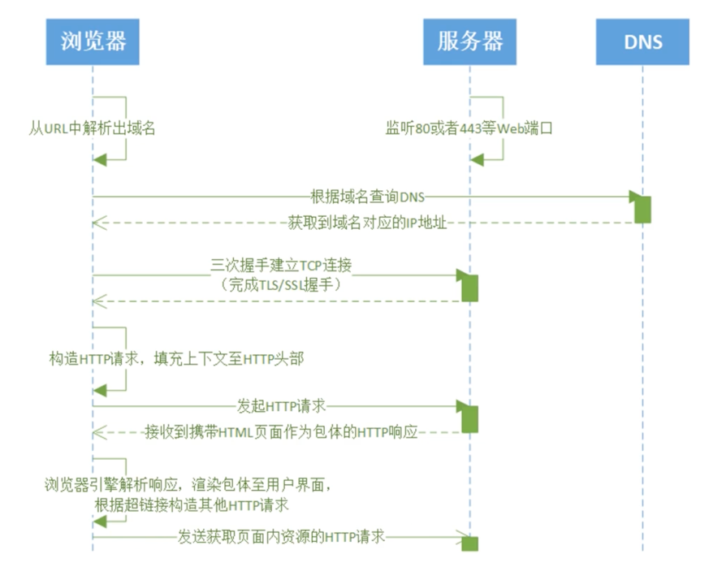

### HTTP 协议定义

a *stateless* application-level *request/response* protocol that uses extensible semantics and
*self-descriptive* message payloads for flexible interaction with network-based *hypertext
information* system.

一种*无状态的*、应用层的、以*请求 / 应答*方式运行的协议，它使用可扩展的语义和*自描述*消息格式，与基于网络的*超
文本信息*系统灵活地互动。

### 推荐书籍

- 《HTTPS 权威指南》
- 《TCP/IP 协议详解》

## 基于 ABNF 语义定义的 HTTP 消息格式

### ABNF (扩充巴科斯-瑙尔范式)操作符

- 空白字符: 用来分隔定义中的各个元素
- 选择 /: 表示多个规则都是可供选择的
  - start-line = request-line / status-line
- 值范围 %c##-##:
  - OCTAL = "0" / "1" / "2" / "3" / "4" / "5" / "6" / "7" 与 OCTAL = %x30-37 等价
- 序列组合 (): 将规则组合起来，视为单个元素
- 不定量重复 m*n:
  - *元素 表示零个或更多元素: *(header-field CRLF)
  - 1*元素 表示一个或更多元素
  - 2*4元素 表示两个至四个元素
- 可选序列 []:
  - [ message-body ]

### ABNF 核心规则

|规则|形式定义|意义|
|---|---|---|
| ALPHA | %x41-5A / %x61-7A | 大写和小写 ASCII 字母 (A-Z, a-z) |
| DIGIT | %x30-39 | 数字 (0-9) |
| HEXDIG | DIGIT / "A" / "B" / "C" / "D" / "E" / "F" | 十六进制数字 (0-9, A-F, a-f) |
| DQUOTE | %x22 | 双引号 |
| SP | %x20 | 空格 |
| HTAB| %x09 | 横向制表符 |
| WSP | SP / HTAB | 空格或横向制表符 |
| LWSP | *(WSP / CRLF WSP) | 直线空白 (晚于换行) |
| VCHAR | %x21-7E | 可见(打印)字符 |
| CHAR | %x01-7F | 任何7位 US-ASCII 字符，不包括 NUL (%x00) |
| OCTET | %x00-FF | 8位数据 |
| CTL | %x00-1F / %x7F | 控制字符 |
| CR | %x0D | 回车 |
| LF | %x0A | 换行 |
| CRLF | CR LF | 互联网标准换行 |
| BIT | "0" / "1" | 二进制数字 |

### 基于 ABNF 描述的 HTTP 协议格式

HTTP-message = start-line *( header-field CRLF ) CRLF [ message-body ]

- start-line = request-line / status-line
  - request-line = method SP request-target SP HTTP-version CRLF
  - status-line = HTTP-version SP status-code SP reason-phrase CRLF
- header-field = field-name ":" OWS field-value OWS
  - OWS = *( SP / HTAB )
  - field-name = token
  - field-value = *( field-content / obs-fold )
- message-body = *OCTET

### ABNF 官方文档

https://www.ietf.org/rfc/rfc5234.txt

巴科斯范式的英文缩写为 BNF，它是以美国人巴科斯(Backus)和丹麦人诺尔(Naur)的名字命名的一种形式化的语法表示方式，
用来描述语法的一种形式体系，是一种典型的元语言。又称巴科斯-诺尔形式(Backus-Naur form)。它不仅能严格地表示语法
规则，而且所描述的语法是与上下文无关的。它具有语法简单、表示明确、便于语法分析和编译的特点。

## 网络为什么要分层: OSI 模型与 TCP/IP 模型

### OSI 概念模型
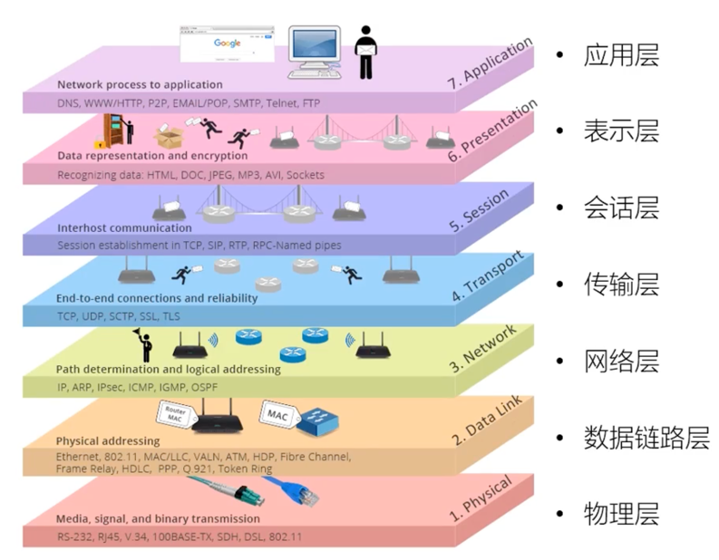

### OSI 模型与 TCP/IP 模型对照
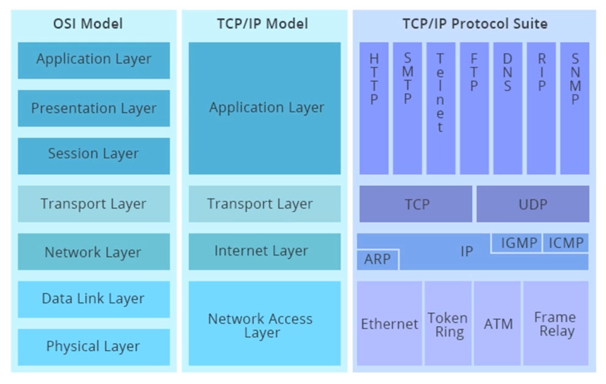

分层的优点:

- 更好的封装，上层协议不需要关心底层协议的实现

分层的缺点:

- 每一层都需要处理，性能下降

网络分层在网络报文中的体现：

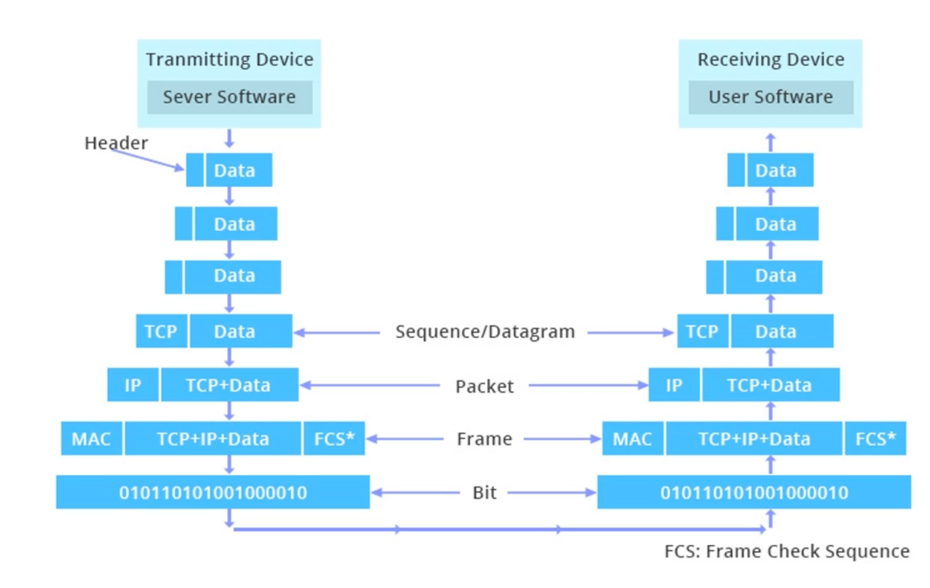

## HTTP 解决了什么问题？

### REST架构的著名论文：
[Architectural Style and the Design of Network-based Software Architectures](https://www.ics.uci.edu/~fielding/pubs/dissertation/fielding_dissertation.pdf)

### Http 协议为什么是现在这个样子？

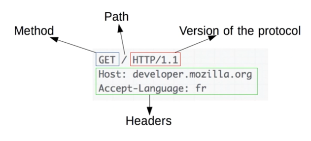

Form Follows Function(形式一定是为了功能服务的)

> Web's major goal was to be a shared information space through which people and machines
> could communicate.
> 
> --Tim Berners Lee

解决 WWW 信息交互必须面对的需求:
- 低门槛
- 可扩展性：巨大的用户群体，超长的寿命
- 分布式系统下的 Hypermedia：大粒度数据的网络传输
- Internet 规模
  - 无法控制的 scalability
    - 不可预测的负载、非法格式的数据、恶意消息
    - 客户端不能保持所有服务器信息，服务器不能保持多个请求间的状态信息
  - 独立的组件部署：新老组件并存
- 向前兼容：自 1993 年起 HTTP0.9/1.0 已经被广泛使用

## 评估 Web 架构的七大关键属性

HTTP 协议应当在以下属性中取得可接受的均衡：

1. 性能 Performance: 影响高可用的关键因素
2. 可伸缩性 Scalability: 支持部署可以互相交互的大量组件
3. 简单性 Simplicity: 易理解、易实现、易验证
4. 可见性 Visibility: 对两个组件间的交互进行监视或者仲裁的能力。如缓存、分层设计等
5. 可移植性 Portability: 在不同的环境下运行的能力
6. 可靠性 Reliability: 出现部分故障时，对整体影响的程度
7. 可修改性 Modifiability: 对系统做出修改的难易程度，由可进化性、可定制性、可扩展性、可配置性、可重用性构成

### 架构属性：性能

- 网络性能 Network Performance
  - Throughput 吞吐量：小于等于带宽 bandwidth
  - Overhead 开销：首次开销、每次开销
- 用户感知到的性能 User-perceived Performance
  - Latency 延迟：发起请求到接收到响应的时间
  - Completion 完成时间：完成一个应用动作所花费的时间
- 网络效率 Network Efficiency
  - 重用缓存、减少交互次数、数据传输距离更近、COD

### 架构属性：可修改性

- 可进化性 Evolvability: 一个组件独立升级而不影响其他组件
- 可扩展性 Extensibility: 向系统添加功能，而不会影响到系统的其他部分
- 可定制性 Customizability: 临时性、定制性地更改某一要素来提供服务，不对常规客户产生影响
- 可配置性 Configurability: 应用部署后可通过修改配置提供新的功能
- 可重用性 Reusability: 组件可以不做修改在其他应用中使用

### REST 架构下的 Web

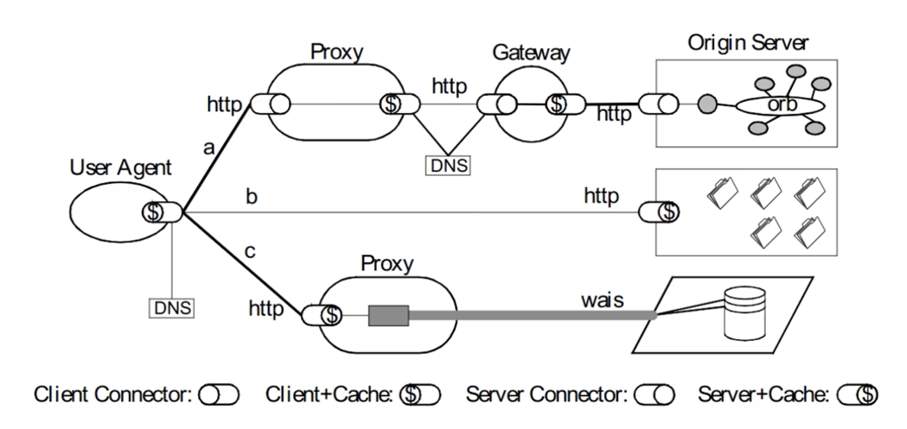

## 从五种架构风格推导出 HTTP 的 REST 架构

- 数据流风格 Data-flow Style
  - 优点：简单性、可进化性、可扩展性、可配置性、可重用性
- 复制风格 Replication Style
  - 优点：用户可察觉的性能、可伸缩性，网络效率、可靠性也可以得到提升
- 分层风格 Hierarchical Style
  - 优点：简单性、可进化性、可伸缩性
- 移动代码风格 Mobile Code Style
  - 优点：可移植性、可扩展性、网络效率
- 点对点风格 Peer-to-Peer Style
  - 优点：可进化性、可重用性、可扩展性、可配置性

### 数据流风格 Data-flow Style

#### 1. 管道与过滤器 Pipe and Filter, PF

每个 Filter 都有输入端和输出端，只能从输入端读取数据，处理后再从输出端产生数据
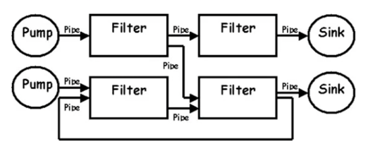

#### 2. 统一接口的管道与过滤器 Uniform Pipe and Filter, UPF
在 PF 上增加了统一接口的约束，所有 Filter 过滤器必须具备同样的接口

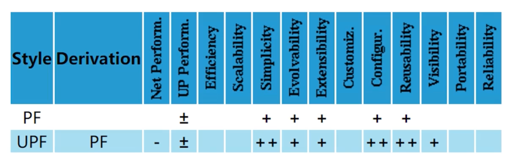

### 复制风格 Replication Style

#### 1. 复制仓库 Replicated Repository, RR
多个进程提供相同的服务，通过反向代理对外提供集中服务

#### 2. 缓存 $
RR 的变体，通过复制请求的结果，为后续请求复用

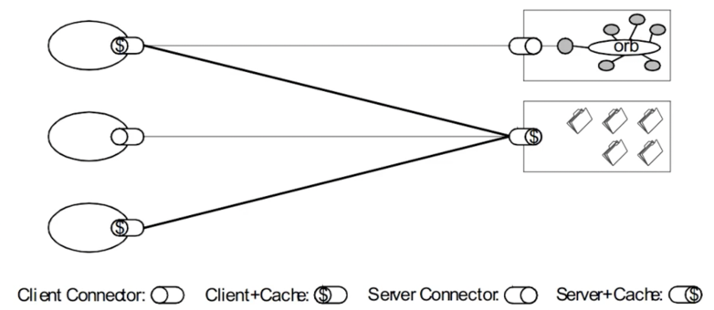

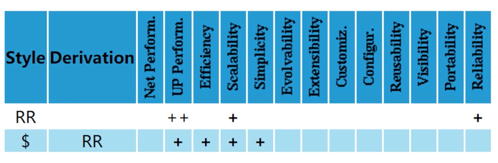

### 分层风格 Hierarchical Style

- 客户端服务器 Client-Server, CS
  - 由 Client 触发请求，Server 监听到请求后产生响应，Client 一直等待收到响应后，会话结束
  - 分离关注点隐藏细节，良好的简单性、可伸缩性、可进化性
- 分层系统 Layered System, LS
  - 每一层为其之上的层服务，并使用在其之下的层所提供的服务，例如 TCP/IP
- 分层客户端服务器 Layered Client-Server, LCS
  - LS + CS，例如正向代理和反向代理，从空间上分为外部层与内部层
- 无状态、客户端服务器 Client-Stateless-Server, CSS
  - 基于CS，服务器上不允许有 session state 会话状态
  - 提升了可见性、可伸缩性、可靠性，但重复数据导致降低网络性能
- 缓存、无状态、客户端服务器 Client-Cache-Stateless-Server, C$SS
  - 提升性能
- 分层、缓存、无状态、客户端服务器 Layered-Client-Cache-Stateless-Server, LC$SS
- 远程会话 Remote Session, RS
  - CS 变体，服务器保存 Application state 应用状态
  - 可伸缩性、可见性差
- 远程数据访问 Remote Data Access, RDA
  - CS 变体，Application state 应用状态同时分布在客户端与服务器
  - 巨大的数据集有可能通过迭代而减少
  - 简单性、可伸缩性差

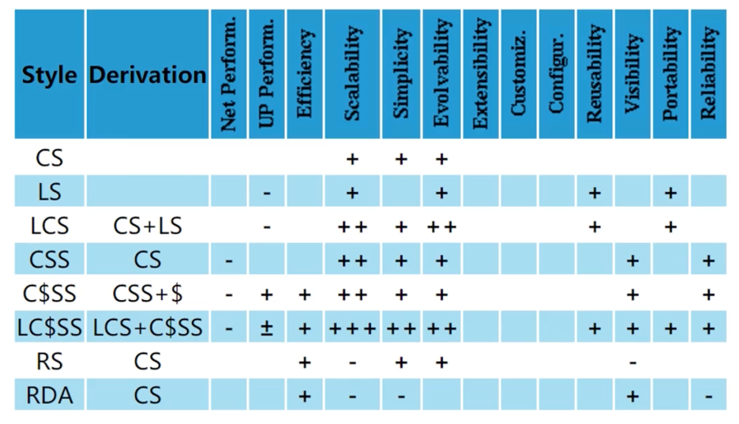

### 移动代码风格 Mobile Code Style

- 虚拟机 Virtual Machine, VM
  - 分离指令与实现
- 远程求值 Remote Evaluation, REV
  - 基于 CS 的 VM, 将代码发送至服务器执行
- 按需代码 Code on Demand, COD
  - 服务器在响应中发回处理代码，在客户端执行
  - 优秀的可扩展性和可配置性，提升用户可察觉性能和网络效率
- 分层、按需代码、缓存、无状态、客户端服务器 Layered-Code-on-Demand-Client-Cache-Stateless-Server, LCODC$SS
  - LC$SS+COD
- 移动代理 Mobile Agent, MA
  - 相当于 REV+COD

### 点对点风格 Peer-to-Peer Style

- Event-based Integration, EBI
  - 基于事件集成系统，如由类似 Kafka 这样的消息系统 + 分发订阅来消除耦合
  - 优秀的可重用性、可扩展性、可进化性
  - 缺乏可理解性
  - 由于消息广播等因素造成的消息风暴，可伸缩性差
- Chiron-2, C2
  - 相当于 EBI + LCS, 控制了消息的方向, 论文 [A Component- and Message-Based Architectural Style for GUI Software](https://users.soe.ucsc.edu/~ejw/papers/c2-icse17.pdf)
- Distributed Objects, DO
  - 组件结对交互
- Brokered Distributed Objects, BDO
  - 引入名字解析组件来简化 DO, 例如 CORBA

### 风格演化

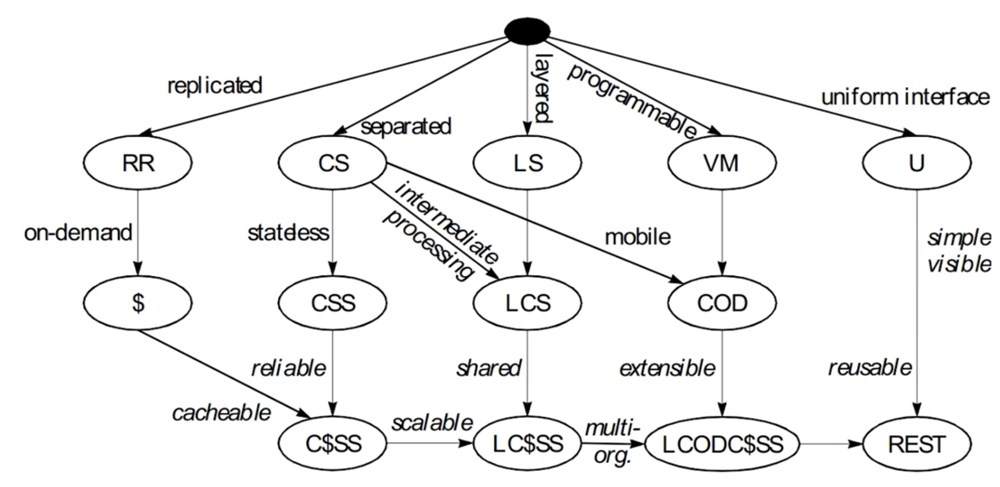

## 使用 Chrome 的 Network 面板分析 HTTP 报文

https://developers.google.com/web/tools/chrome-devtools/network

### 过滤器: 属性过滤

多属性间通过空格实现 AND 操作

- domain: 仅显示来自指定域的资源。可以使用通配符字符(*)纳入多个域
- has-response-header: 显示包含指定 HTTP 响应头的资源
- is: 使用 is:running 可以查找 WebSocket 资源，is:from-cache 可查找缓存读出的资源
- larger-than: 显示大于指定大小的资源(以字节为单位)。将值设为 1000 等同于设置为 1k
- method: 显示通过指定 HTTP 方法类型检索的资源
- mime-type: 显示指定 MIME 类型的资源
- mixed-content: 显示所有混合内容资源(mixed-content:all)，或者仅显示当前显示的资源(mixed-content:displayed)
- scheme: 显示通过未保护 HTTP (scheme:http) 或受保护 HTTPS (scheme:https) 检索的资源
- set-cookie-domain: 显示具有 Set-Cookie 标头并且 Domain 属性与指定值匹配的资源
- set-cookie-name: 显示具有 Set-Cookie 标头并且名称与指定值匹配的资源
- set-cookie-value: 显示具有 Set-Cookie 标头并且值与指定值匹配的资源
- status-code: 仅显示 HTTP 状态代码与指定代码匹配的资源

### 请求列表的排序

- 时间排序，默认
- 按列排序
- 按活动时间排序
  - Start Time: 发出的第一个请求位于顶部
  - Response Time: 开始下载的第一个请求位于顶部
  - End TIme: 完成的第一个请求位于顶部
  - Total Duration: 连接设置时间和请求/响应时间最短的请求位于顶部
  - Latency: 等待最短响应时间的请求位于顶部

查看请求上下游：按住 shift 键悬停在请求上，绿色是上游，红色是下游。

### 浏览器加载时间

- 触发流程
  - 解析 HTML 结构
  - 加载外部脚本和样式表文件
  - 解析并执行脚本代码，部分脚本会阻塞页面的加载
  - DOM 树构建完成，DOMContentLoaded 事件
  - 加载图片等外部文件
  - 页面加载完毕，load 事件

### 请求时间详细分布

- Queueing: 浏览器在以下情况下对请求排队
  - 存在更高优先级的请求
  - 此源已打开六个 TCP 连接，达到限值，仅适用于 HTTP/1.0 和 HTTP/1.1
  - 浏览器正在短暂分配磁盘缓存中的空间
- Stalled: 请求可能会因 Queueing 中描述的任何原因而停止
- DNS Lookup: 浏览器正在解析请求的 IP 地址
- Proxy Negotiation: 浏览器正在与代理服务器协商请求
- Request sent: 正在发送请求
- ServiceWorker Preparation: 浏览器正在启动 Service Worker
- Request to ServiceWorker: 正在将请求发送到 Service Worker
- Waiting (TTFB): 浏览器正在等待响应的第一个字节。TTFB 表示 Time to First Byte，此时间包括1次往返延迟时间及服务器准备响应所用的时间
- Content Download: 浏览器正在接收响应
- Receiving Push: 浏览器正在通过 HTTP/2 服务器推送接收此响应的数据
- Reading Push: 浏览器正在读取之前收到的本地数据

## URI 的基本格式以及与 URL 的区别

### 什么是 URI

- URL: RFC1738(1994.12)，Uniform Resource Locator，表示资源的位置，期望提供查找资源的方法
- URN: RFC2141(1997.5)，Uniform Resource Name，期望为资源提供持久的、位置无关的标识方式，并允许简单地将多个命名空间映射到单个 URN 命名空间
  - 例如磁力链接 magnet:?xt=urn:sha1:YNCKHTQC5C
- URI: RFC1630(1994.6)、RFC3986(2005.1，取代 RFC2396 和 RFC2732)，Uniform Resource Identifier，用以区分资源，是 URL 和 URN 的超集，用以取代 URL 和 URN 概念

### Uniform Resource Identifier

- Resource 资源
- Identifier 标识符
- Uniform 统一

### URI 的组成

- 组成: schema, user information, host, port, path, query, fragment

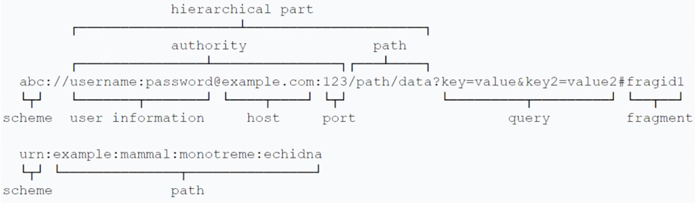

https://tools.ietf.org/html/rfc7231?test=1#page-7

### URI 格式: ABNF 定义

- URI = schema ":" hier-part [ "?" query ] [ "#" fragment ]
- schema = ALPHA *( ALPHA / DIGIT / "+" / "-" / "." )
  - 例如: http, https, ftp, mailto, rtsp, file, telnet
- query = *( pchar / "/" / "?" )
- fragment = *( pchar / "/" / "?" )
- hier-part = "//" authority path-abempty / path-absolute / path-rootless / path-empty
  - authority = [ userinfo "@" ] host [ ":" port ]
    - userinfo = *( unreserved / pct-encoded / sub-delims / ":" )
    - host = IP-literal / IPv4address / reg-name
    - port = *DIGIT
  - path = path-abempty / path-absolute / path-noscheme / path-rootless / path-empty
    - path-abempty = *( "/" segment )
      - 以 / 开头的路径或者空路径
    - path-absolute = "/" [ segment-nz *( "/" segment )]
      - 以 / 开头的路径，但不能以 // 开头
    - path-noscheme = segment-nz-nc *( "/" segment )
      - 以非 : 号开头的路径
    - path-rootless = segment-nz *( "/" segment )
      - 相对 path-noscheme，增加允许以 : 号开头的路径
    - path-empty = 0 <pchar>
      - 空路径

## 为什么要对 URI 进行编码？

- 传输数据中，如果存在用作分隔符的保留字符时怎么办？
- 对可能 产生歧义性的数据编码
  - 不在 ASCII 范围内的字符
  - ASCII 中不可显示的字符
  - URI 中规定的保留字符
  - 不安全字符(传输环节中可能会被不正确处理)，如空格、引号、尖括号等

示例：
https://www.baidu.com/s?wd=?#!
https://www.baidu.com/s?wd=极客 时间
https://www.baidu.com/s?wd=极客 '>时 间

### URI 保留字符与非保留字符

- 保留字符
  - reserved = gen-delims / sub-delims
    - gen-delims = ":" / "/" / "?" / "#" / "[" / "]" / "@"
    - sub-delims = "!" / "$" / "&" / "'" / "(" / ")" / "*" / "+" / "," / ";" / "="
- 非保留字符
  - unreserved = ALPHA / DIGIT / "-" / "." / "_" / "~"
    - ALPHA: %41-%5A and %61-%7A
    - DIGIT: %30-%39
    - -: %2D
    - .: %2E
    - _: %5F
    - ~: %7E，某些实现将其认为保留字符

### URI 百分号编码

- 百分号编码的方式
  - pct-encoded = "%" HEXDIG HEXDIG
    - US-ASCII: 128 个字符(95个可显示字符，33个不可显示字符)
    - 参见: https://zh.wikipedia.org/wiki/ASCII
  - 对于 HEXDIG 十六进制中的字母，大小写等价
- 非 ASCII 字符（例如中文）：建议先 UTF8 编码，再 US-ASCII 编码
- 对 URI 合法字符，编码与不编码是等价的
  - 例如，"URI 转换" 既可以"URI%20%E8%BD%AC%E6%8D%A2"，也可以"%55%52%49%20%E8%BD%AC%E6%8D%A2"
    - https://www.baidu.com/s?wd=URI%20%E8%BD%AC%E6%8D%A2
    - https://www.baidu.com/s?wd=%55%52%49%20%E8%BD%AC%E6%8D%A2

## 详解 HTTP 的请求行

request-line = method SP request-target SP http-version CRLF

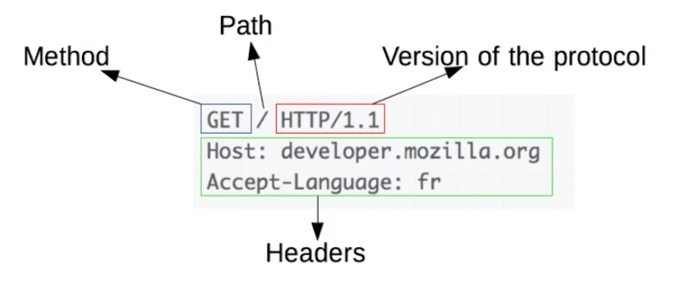

- method 方法：指明操作目的，动词
- request-target = origin-form / absolute-form / authority-form / asterisk-form
  - origin-form = absolute-path [ "?" query ]
    - 想 origin server 发起的请求，path 为空时必须传递 /
  - absolute-form = absolute-URI
    - 仅用于向正向代理 proxy 发起请求时，详见正向代理与隧道
  - authority-form = authority
    - 仅用于 CONNECT 方法，例如 CONNECT www.example.com:80 HTTP/1.1
  - asterisk-form = "*"
    - 仅用于 OPTIONS 方法

### 常见方法 (RFC7231)

- GET: 主要的获取信息方法，大量的性能优化都针对该方法，幂等方法
- HEAD: 类似 GET 方法，但服务器不发送 BODY，用以获取 HEAD 元数据，幂等方法
- POST: 常用于提交 HTML Form 表单、新增资源等
- PUT: 更新资源，带条件时是幂等方法
- DELETE: 删除资源，幂等方法
- CONNECT: 建立 tunnel 隧道
- OPTIONS: 显示服务器对访问资源支持的方法，幂等方法
- TRACE: 回显服务器收到的请求，用于定位问题。有安全风险

### 用于文档管理的 WEBDAV 方法 (RFC2518)

- PROPFIND: 从 Web 资源中检索以 XML 格式存储的属性。它也被重载，以允许一个检索远程系统的集合结构（也叫目录层次结构）
- PROPPATCH: 在单个原子性动作中更改和删除资源的多个属性
- MKCOL: 创建集合或者目录
- COPY: 将资源从一个 URI 复制到另一个 URI
- MOVE: 将资源从一个 URI 移动到另一个 URI
- LOCK: 锁定一个资源。WebDAV 支持共享锁和互斥锁
- UNLOCK: 解除资源的锁定

## HTTP 的响应码

status-line = HTTP-version SP status-code SP reason-phrase CRLF

- status-code = 3*DIGIT
- reason-phrase = *( HTAB / SP / VCHAR / obs-text )

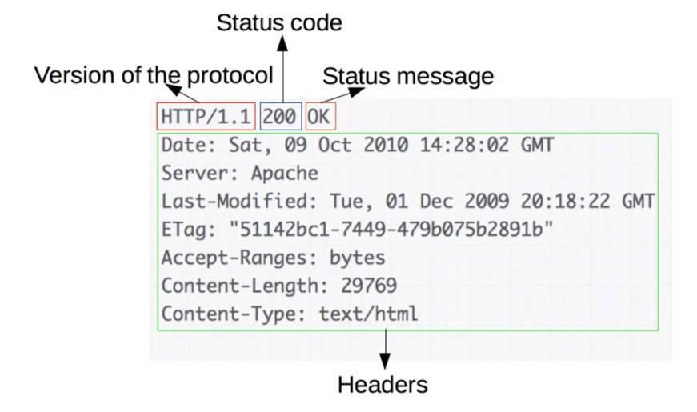

### 响应码分类：1xx

响应码规范: RFC6585(2012.4)、RFC7231(2014.6)

- 1xx: 请求已接收到，需要进一步处理才能完成，HTTP/1.0 不支持
  - 100 Continue: 上传大文件前使用
    - 由客户端发起请求中携带 Expect: 100-continue 头部触发
  - 101 Switch Protocols: 协议升级使用
    - 由客户端发起请求中携带 Upgrade: 头部触发，如升级 websocket 或者 http/2.0
  - 102 Processing: WebDAV 请求可能包含许多涉及文件操作的子请求，需要很长时间才能完成请求。该代码表示服务器已经收到并正在处理请求，但无响应可用。这样可以防止客户端超时，并假设请求丢失

### 响应码分类: 2xx

- 2xx: 成功处理请求
  - 200 OK: 成功返回响应
  - 201 Created: 有新资源在服务器端被成功创建
  - 202 Accepted: 服务器接收并开始处理请求，但请求未处理完成。这样一个模糊的概念是有意如此设计，可以覆盖更多的场景。例如异步、需要长时间处理的任务。
  - 203 Non-Authoritative Information: 当代理服务器修改了 origin server 的原始响应包体时(例如更换了 HTML 中的元素值)，代理服务器可以通过修改200为203的方式告知客户端这一事实，方便客户端为这一行为做出相应的处理。203相应可以被缓存。
  - 204 No Content: 成功执行了请求且不携带响应包体，并暗示客户端无需更新当前的页面视图。
  - 205 Reset Content: 成功执行了请求且不携带响应包体，同时指明客户端需要更新当前页面视图。
  - 206 Partial Content: 使用 range 协议时返回部分响应内容时的响应码
  - 207 Multi-Status: RFC4918，在 WebDAV 协议中以 XML 返回多个资源的状态。
  - 208 Already Reported: RFC5842，为避免相同集合下资源在207响应码下重复上报，使用208可以使用父集合的响应码

### 响应码分类: 3xx

- 3xx: 重定向使用 Location 指向的资源或者缓存中的资源。在 RFC2068 中规定客户端重定向次数不应超过5次，以防止死循环。
  - 300 Multiple Choices: 资源有多种表述，通过300返回给客户端后由其自行选择访问哪一种表述。
  - 301 Moved Permanently: 资源永久性的重定向到另一个 URI 中
  - 302 Found: 资源临时的重定向到另一个 URI 中
  - 303 See Other: 重定向到其他资源，常用于 POST/PUT 等方法的响应中
  - 304 Not Modified: 当客户端拥有可能过期的缓存时，会携带缓存的标识etag、时间等信息询问服务器缓存是否仍可复用，而304是告诉客户端可以复用缓存
  - 307 Temporary Redirect: 类似302，但明确重定向后请求方法必须与原请求方法相同，不得改变
  - 308 Permanent Redirect: 类似301，但明确重定向后请求方法必须与原请求方法相同，不得改变

### 响应码分类: 4xx

- 4xx: 客户端出现错误
  - 400 Bad Request: 服务器认为客户端出现了错误，但不能明确判断为以下哪种错误时使用此错误码。例如 HTTP 请求格式错误
  - 401 Unauthorized: 用户认证信息缺失或者不正确，导致服务器无法处理请求
  - 403 Forbidden: 服务器理解请求的含义，但没有权限执行此请求
  - 404 Not Found: 服务器没有找到对应的资源
  - 405 Method Not Allowed: 服务器不支持请求行中的 method 方法
  - 406 Not Acceptable: 对客户端指定的资源表述不存在（例如对语言或者编码有要求），服务器返回表述列表供客户端选择
  - 407 Proxy Authentication Required: 对需要经由代理的请求，认证信息未通过代理服务器的验证
  - 408 Request Timeout: 服务器接收请求超时
  - 409 Conflict: 资源冲突，例如上传文件时目标位置已经存在版本更新的资源
  - 410 Gone: 服务器没有找到对应的资源，且明确的知道该位置永久性找不到该资源
  - 411 Length Required: 如果请求含有包体且未携带 Content-Length 头部，且不属于 chunk 类请求时，返回411
  - 412 Precondition Failed: 复用缓存时传递的 If-Unmodified-Since 或 If-None-Match 头部不被满足
  - 413 Payload Too Large/Request Entity Too Large: 请求的包体超出服务器能处理的最大长度
  - 414 URI Too Long: 请求的 URI 超出服务器能接受的最大长度
  - 415 Unsupported Media Type: 上传的文件类型不被服务器支持
  - 416 Range Not Satisfiable: 无法提供 Range 请求中指定的那段包体
  - 417 Expectation Failed: 对应 Expect 请求头部期待的情况无法满足时的响应码
  - 421 Misdirected Request: 服务器认为这个请求不该发给它，因为它没有能力处理
  - 426 Upgrade Required: 服务器拒绝基于当前 HTTP 协议提供服务，通过 Upgrade 头部告知客户端必须升级协议才能继续处理
  - 428 Precondition Required: 用户请求中缺失了条件类头部，例如 If-Match
  - 429 Too Many Requests: 客户端发送请求的速率过快
  - 431 Request Header Fields Too Large: 请求的 HEADER 头部大小超过限制
  - 451 Unavailable For Legal Reasons: RFC7725, 由于法律原因资源不可访问

### 响应码分类: 5xx

- 5xx: 服务器端出现错误
  - 500 Internal Server Error: 服务器内部错误，且不属于一下错误类型
  - 501 Not Implemented: 服务器不支持实现请求所需要的功能
  - 502 Bad Gateway: 代理服务器无法获取到合法响应
  - 503 Service Unavailable: 服务器资源尚未准备好处理当前请求
  - 504 Gateway Timeout: 代理服务器无法及时的从上游获得响应
  - 505 HTTP Version Not Supported: 请求使用的 HTTP 协议版本不支持
  - 507 Insufficient Storage: 服务器没有足够的空间处理请求
  - 508 Loop Detected: 访问资源时检测到循环
  - 511 Network Authentication Required: 代理服务器发现客户端需要进行身份验证才能获得网络访问权限

## 如何管理跨代理服务器的长短连接

### HTTP 连接的常见流程(短连接)

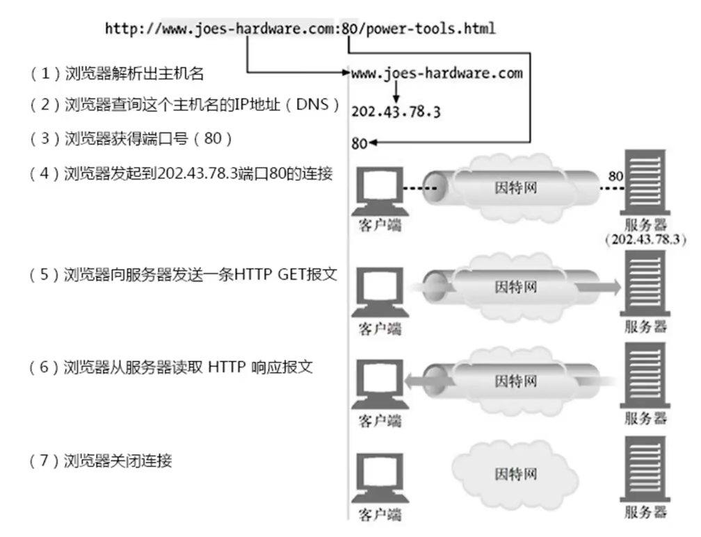

### 从 TCP 编程上看 HTTP 请求处理

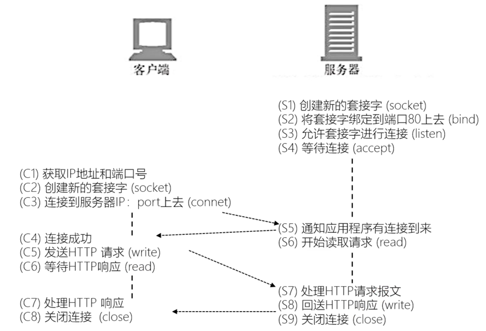

### 短连接与长连接

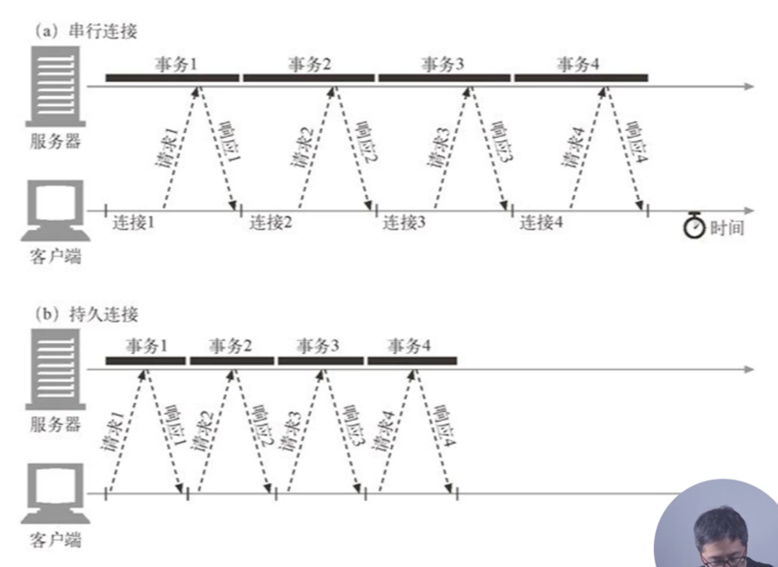

- Connection 头部
  - Keep-Alive: 长连接
    - 客户端请求长连接
      - Connection: Keep-Alive
    - 服务器表示支持长连接
      - Connection: Keep-Alive
    - 客户端复用连接
    - HTTP/1.1 默认支持长连接
      - Connection: Keep-Alive 无意义
  - Close: 短连接
  - 对代理服务器的要求
    - 不转发 Connection 列出的头部，该头部仅与当前连接相关

如果存在代理服务器的话，Connection 仅针对当前连接有效

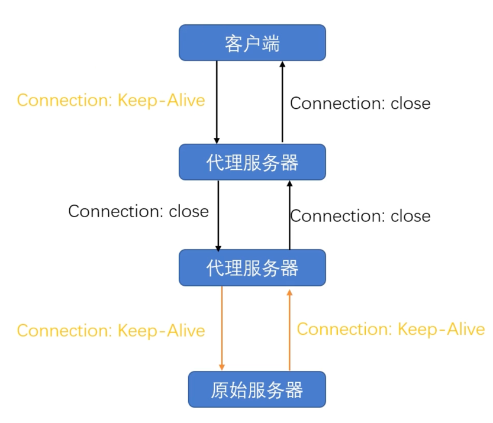

### 代理服务器对长连接的支持

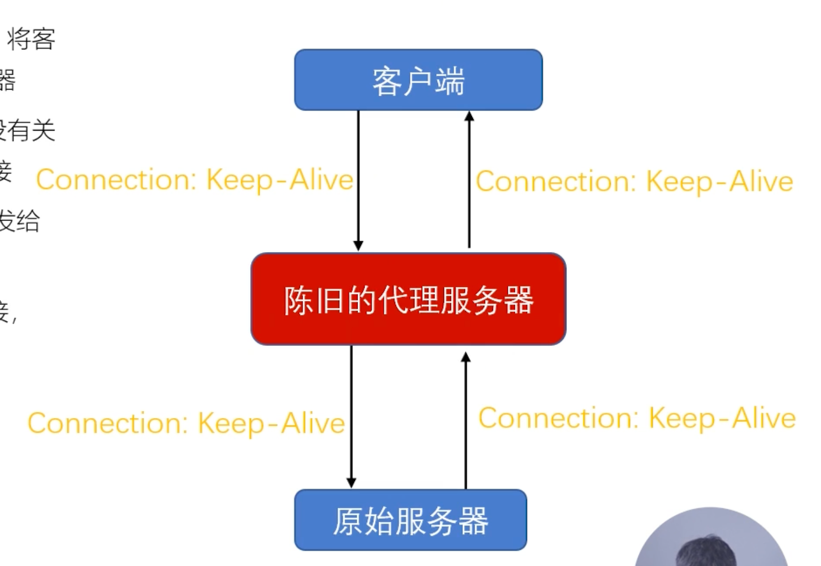

- 问题：各方间错误使用了长连接
  - 客户端发起长连接
  - 代理服务器陈旧，不能正确的处理请求的 Connection 头部，将客户端请求中的 Connection: Keep-Alive 原样转发给上游服务器
  - 上游服务器正确的处理了 Connection 头部，在发送响应后没有关闭连接，而试图保持、复用与不认长连接的代理服务器的连接
  - 代理服务器收到响应中 Connection: Keep-Alive 后不认，转发给客户端，同时等待服务器关闭短连接
  - 客户端收到了 Connection: Keep-Alive，认为可以复用长连接，继续在该连接上发起请求
  - 代理服务器出错，因为短连接上不能发起两次请求
- Proxy-Connection
  - 陈旧的代理服务器不识别该头部：退化为短连接
  - 新版本的代理服务器理解该头部
    - 与客户端建立长连接
    - 与服务器使用 Connection 替代 Proxy-Connection 头部

## HTTP 消息在服务器端的路由

### Host 头部

- Host = uri-host [ ":" port ]
  - HTTP/1.1 规范要求，不传递 Host 头部则返回 400 错误响应码
  - 为防止陈旧的代理服务器，发向正向代理的请求 request-target 必须以 absolute-form 形式出现
    - request-line = method SP request-target SP HTTP-version CRLF
    - absolute-form = absolute-URI
      - absolute-URI = scheme ":" hier-part [ "?" query ]

### 规范与实现间是有差距的

关于 Host 头部：https://tools.ietf.org/html/rfc7230#section-5.4

- A client MUST send a Host header field in all HTTP/1.1 request messages.
- A server MUST respond with a 400 (Bad Request) status code to any HTTP/1.1 request message that *lacks* a Host header field and to any request message that contains *more than one* Host header field or a Host header field with an *invalid field-value*.

### Host 头部与消息的路由

1. 建立 TCP 连接
   - 确定服务器的 IP 地址
2. 接收请求
3. 寻找虚拟主机
   - 匹配 Host 头部与域名
4. 寻找 URI 的处理代码
   - 匹配 URI
5. 执行处理请求的代码
   - 访问资源
6. 生成 HTTP 响应
   - 各中间件基于 PF 架构串行修改响应
7. 发送 HTTP 响应
8. 记录访问日志

## 代理服务器转发消息时的相关头部

### 存在多级代理时如何传递用户的 IP 地址？

- TCP 连接四元组(src ip, src port, dst ip, dst port)
- HTTP 头部 X-Forwarded-For 用于传递 IP
- HTTP 头部 X-Real-IP 用于传递用户 IP

### 消息转发

- Max-Forwards 头部
  - 限制 Proxy 代理服务器的最大转发次数，仅对 TRACE/OPTIONS 方法有效
  - Max-Forwards = 1*DIGIT
- Via 头部
  - 指明经过的代理服务器名称及版本
  - Via = 1#( received-protocol RWS received-by [ RWS comment ])
    - received-protocol = [ protocol-name "/" ] protocol-version
    - received-by = ( uri-host [ ":" port ] ) / pseudonym
    - pseudonym = token
- Cache-Control: no-transform
  - 禁止代理服务器修改响应包体

## 请求与响应的上下文

### 请求的上下文: User-Agent

指明客户端的类型信息，服务器可以据此对资源的表述做抉择

- User-Agent = product *( RWS ( product / comment ) )
  - product = token [ "/" product-version ]
  - RWS = 1*( SP / HTAB )
- 例如:
  - User-Agent: Mozilla/5.0 (Windows NT 10.0; WOW64; rv:66.0) Gecko/20100101 Firefox/66.0
  - User-Agent: Mozilla/5.0 (Macintosh; Intel Mac OS X 10_15_7) AppleWebKit/537.36 (KHTML, like Gecko) Chrome/99.0.4844.83 Safari/537.36

### 请求的上下文: Referer

浏览器对来自某一页面的请求自动添加的头部

- Referer = absolute-URI / partial-URI
- Referer 不会被添加的场景 (受 Referrer-Policy 影响)
  - 来源页面采用的协议为表示本地文件的 "file" 或者 "data" URI
  - 当前请求页面采用的是 http 协议，而来源页面采用的是 https 协议
- 服务器端常用于统计分析、缓存优化、防盗链等功能

### 请求的上下文: From

主要用于网络爬虫，告诉服务器如何通过邮件联系到爬虫的负责人

- From = mailbox
  - 例如：From: webmaster@example.org

### 响应的上下文: Server

指明服务器上所用软件的信息，用于帮助客户端定位问题或者统计数据

- Server = product *( RWS ( product / comment ) )
  - product = token [ "/" product-version ]
- 例如:
  - Server: nginx
  - Server: openresty/1.13.6.2

### 响应的上下文: Allow 与 Accept-Ranges

- Allow: 告诉客户端，服务器上该 URI 对应的资源允许哪些方法的执行
  - Allow = #method
  - 例如:
    - Allow: GET, HEAD, PUT
- Accept-Ranges: 告诉客户端，服务器上该资源是否允许 range 请求
  - Accept-Ranges = acceptable-ranges
  - 例如:
    - Accept-Ranges: bytes
    - Accept-Ranges: none
