# HTTP2 协议

https://httpwg.org/specs/

## HTTP/1.1 发展中遇到的问题

### HTTP/1.1 发明以来发生了哪些变化？

- 从几 KB 大小的消息，到几 MB 大小的消息
- 每个页面小于 10 个资源，到每页面 100 多个资源
- 从文本为主的内容，到富媒体（如图片、声音、视频）为主的内容
- 对页面内容实时性高要求的应用越来越多

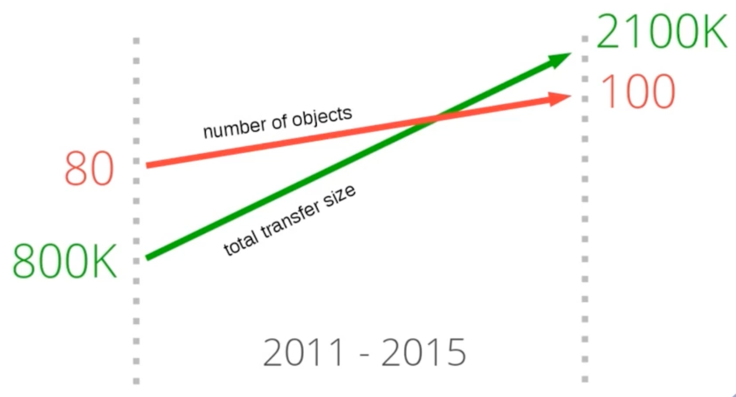

### HTTP/1.1 的高延迟问题

- 高延迟带来页面加载速度的降低
  - 随着带宽的增加，延迟并没有显著下降
  - 并发连接有限
  - 同一连接同时只能在完成一个 HTTP 事务 (请求/响应) 才能处理下一个事务

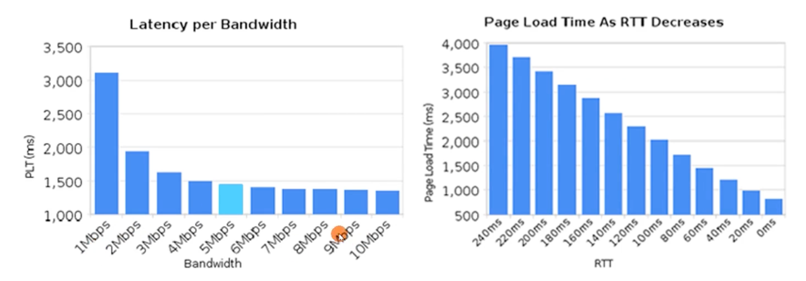

高延时 vs 高带宽

- 单连接上的串行请求
- 无状态导致的高传输量 (低网络效率)

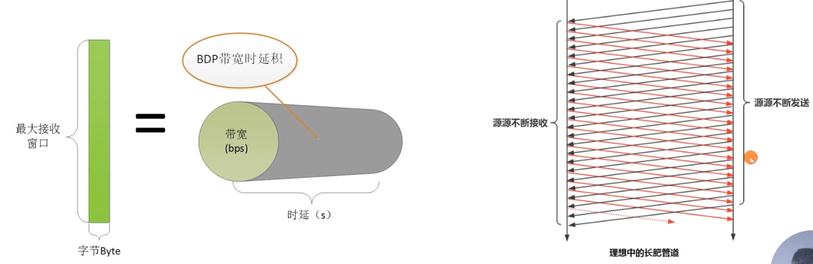

无状态特性带来的巨大 HTTP 头部

- 重复传输的体积巨大的 HTTP 头部

### HTTP/1.1 为了解决性能问题做过的努力

- Spriting 合并多张小图为一张大图供浏览器 JS 切割使用
- Inlining 内联，将图片嵌入到 css 或者 html 文件中，减少网络请求次数
- Concatenation 拼接，将多个体积较小的 js 使用 webpack 等工具打包成一个体积更大的 js 文件
- Sharding 分片，将同一页面的资源分散到不同域名下，提升连接上限

### HTTP/1.1 不支持服务器推送消息

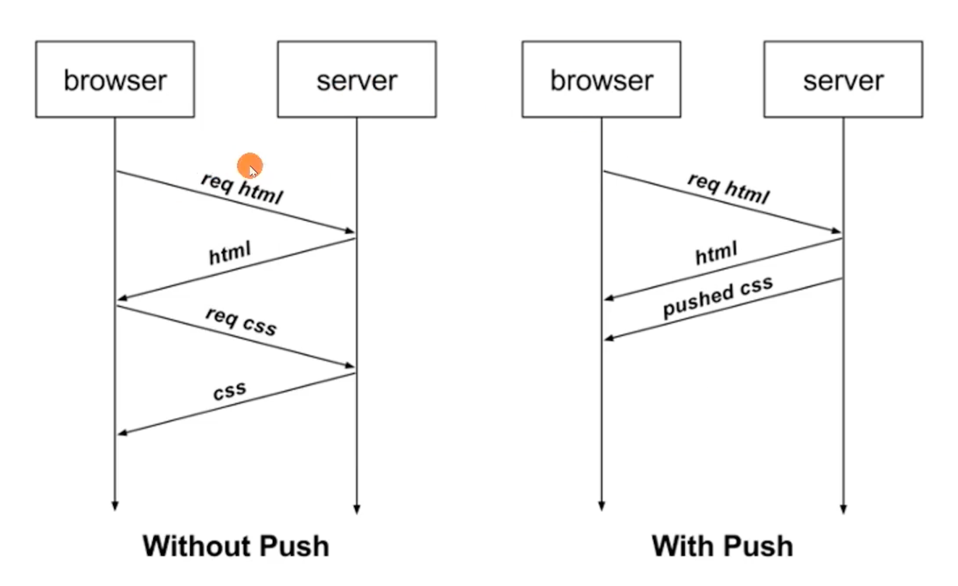


## HTTP/2 特性概述

### 解决 HTTP/1 性能问题的 HTTP/2

- SPDY (2012-2016)
- HTTP2 (RFC7540, 2015.5)
  - 在应用层上修改，基于并充分挖掘 TCP 协议性能
  - 客户端向 server 发送 request 这种基本模型不会变
  - 老的 scheme 不会变，没有 http2://
  - 使用 http/1.x 的客户端和服务器可以无缝的通过代理方式转接到 http/2 上
  - 不识别 http/2 的代理服务器可以将请求降级到 http/1.x

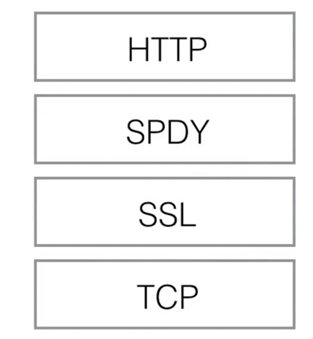

多路复用带来的提升

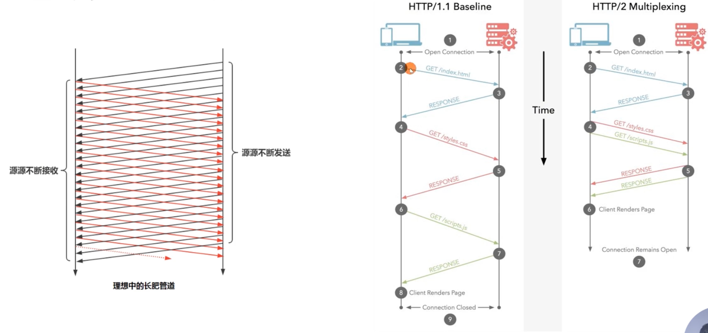

### HTTP/2 的演示

https://http2.akamai.com/demo

### HTTP/2 主要特性

- 传输数据量的大幅减小
  - 以二进制方式传输
  - 标头压缩
- 多路复用及相关功能
  - 消息优先级
- 服务器消息推送
  - 并行推送


## 如何使用 Wireshark 解密 TLS/SSL 报文？

### TLS1.2 的加密算法

常见加密套件


对称加密算法：AES_128_GCM
每次建立连接后，加密密钥都不一样

密钥生成算法：ECDHE
客户端与服务器通过交换部分信息，各自独立生成最终一致的密钥

### Wireshark 如何解密 TLS 消息？

原理：获得 TLS 握手阶段生成的密钥
- 通过 Chrome 浏览器 DEBUG 日志中的握手信息生成密钥

步骤：
- 配置 Chrome 输出 DEBUG 日志
  - 配置环境变量 SSLKEYLOGFILE
- 在 Wireshark 中配置解析 DEBUG 日志
  - 编辑 -> 首选项 -> Protocols -> TLS/SSL
    - (Pre)-Master-Secret log filename

Mac上配置环境变量：
```shell
touch ~/tls_key.log                       # 创建日志文件
chmod a+w ~/tls_key.log                   # 设置写入权限
export SSLKEYLOGFILE=~/tls_key.log        # 设置 SSLKEYLOGFILE 环境变量
open /Applications/Google\ Chrome.app  # 打开 Chrome 浏览器
```

### 二进制格式与可见性

TLS/SSL 降低了可见性门槛
代理服务器没有私钥不能看到内容

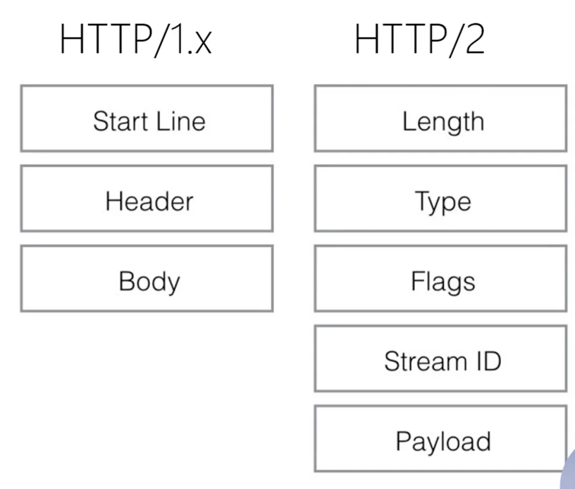


## h2c: 在 TCP 上从 HTTP/1 升级到 HTTP/2

### HTTP/2 是不是必须基于 TLS/SSL 协议？

- IETF 标准不要求必须基于 TLS/SSL 协议
- 浏览器要求必须基于 TLS/SSL 协议
- 在 TLS 层 ALPN (Application Layer Protocol Negotiation) 扩展做协商，只认 HTTP/1.x 的代理服务器不会干扰 HTTP/2
- schema: http:// 和 https:// 默认基于 80 和 443 端口
- h2: 基于 TLS 协议运行的 HTTP/2 被称为 h2
- h2c: 直接在 TCP 协议之上运行的 HTTP/2 被称为 h2c

### h2 与 h2c

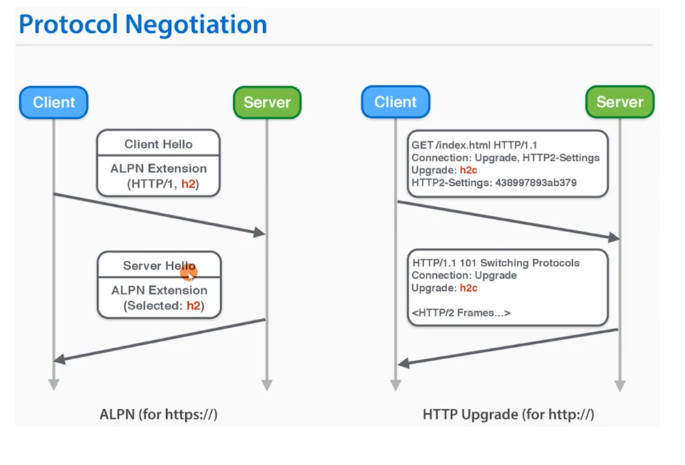

### H2C: 不使用 TLS 协议进行协议升级

客户端测试工具: curl (7.46.0版本)
```shell
curl http://nghttp2.org --http2 -v
```

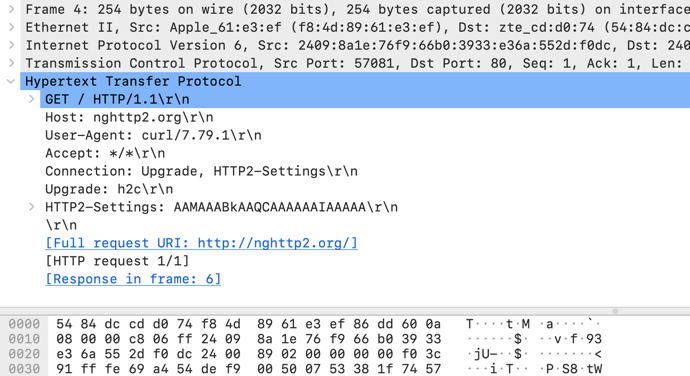
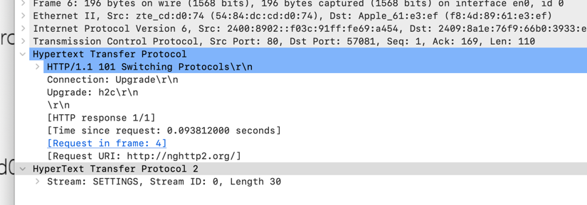

### H2C: 客户端发送的 Magic 帧

- Preface (ASCII编码，12字节)
  - 何时发送？
    - 接收到服务器发送来的 101 Switching Protocols
    - TLS 握手成功后
  - Preface 内容
    - 0x505249202a20485454502f322e300d0a0d0a534d0d0a0d0a
    - PRI * HTTP/2.0\r\n\r\nSM\r\n\r\n
  - 发送完毕后，应紧跟 SETTING 帧

### 统一的连接过程

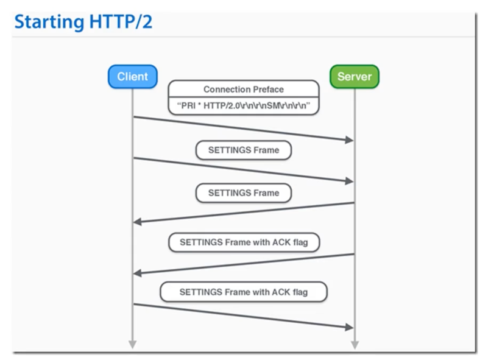


## h2: 在 TLS 上从 HTTP/1 升级到 HTTP/2

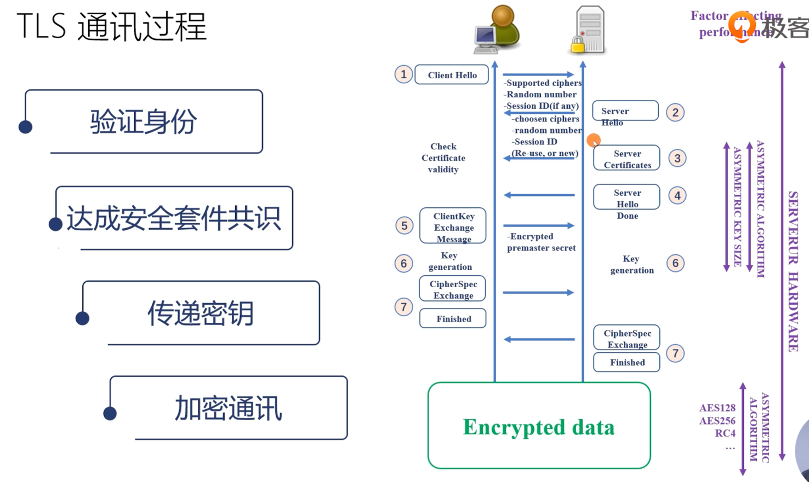

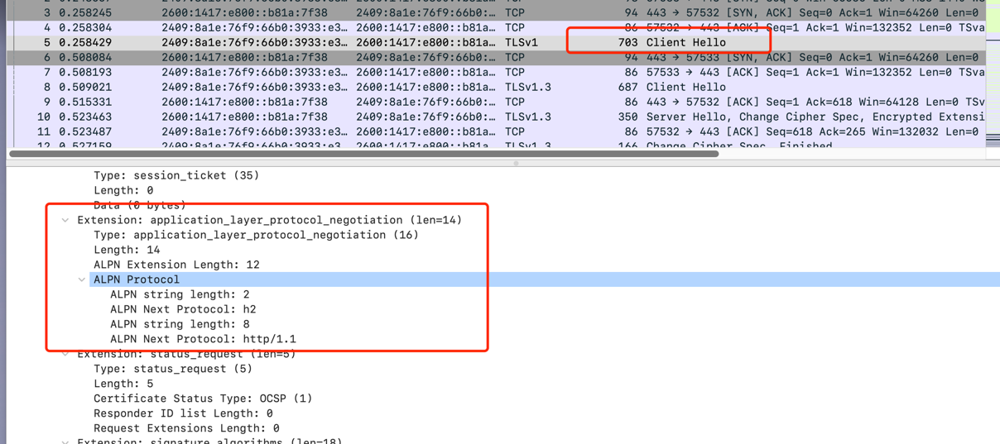
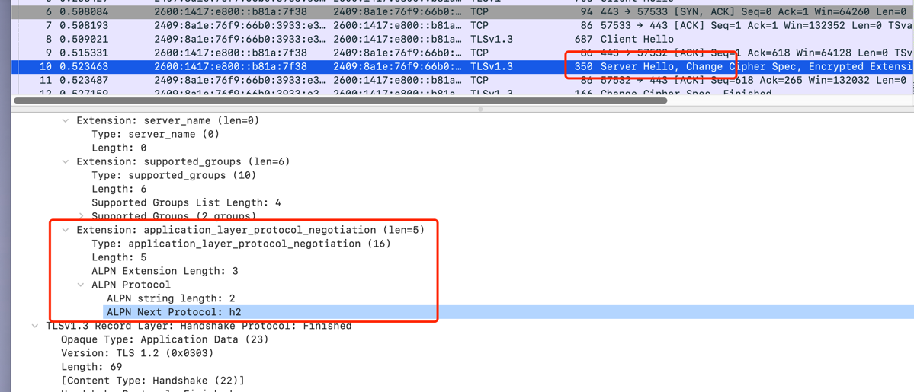


## 帧、消息、流的关系

### HTTP/2 核心概念

- 连接 Connection: 一个 TCP 连接，包含一个或者多个 Stream
- 数据流 Stream: 一个双向通讯数据流，包含一条或多条 Message
- 消息 Message: 对应 HTTP/1 中的请求或者响应，包含一条或者多条 Frame
- 数据帧 Frame: 最小单位，以二进制压缩格式存放 HTTP/1 中的内容

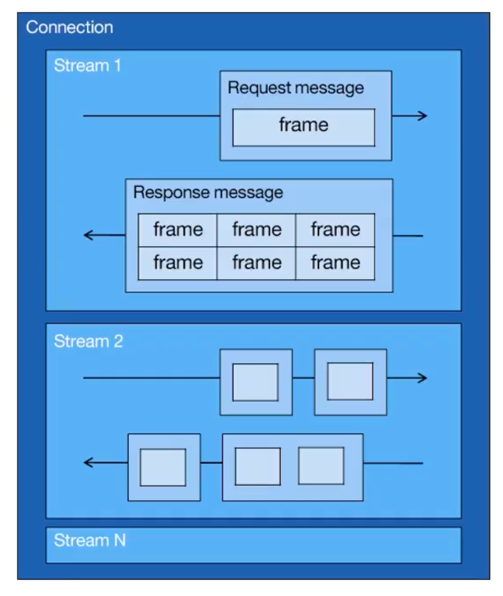

### Stream、Message、Frame 之间的关系

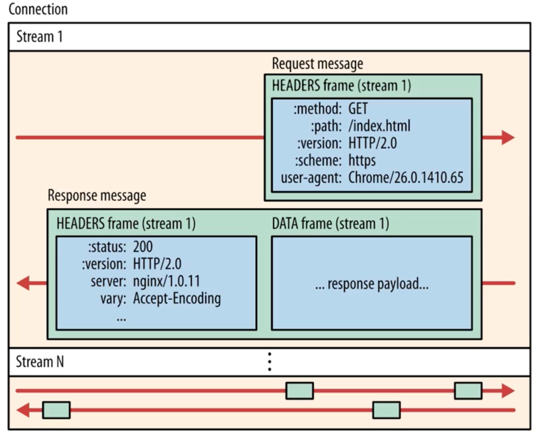

### 消息的组成: Headers 帧与 Data 帧

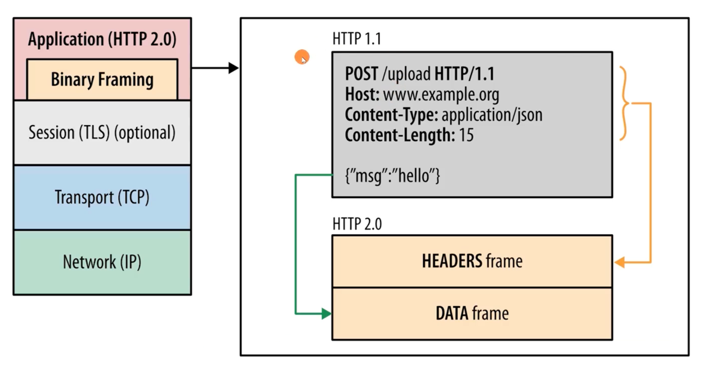

### 传输中无序，接收时组装

同一个 Stream 中的 Frame 必须是有序的，跨 Stream 可以无序

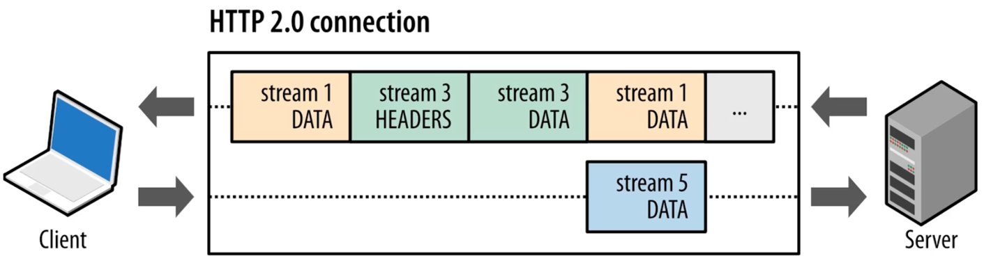

### 消息与帧

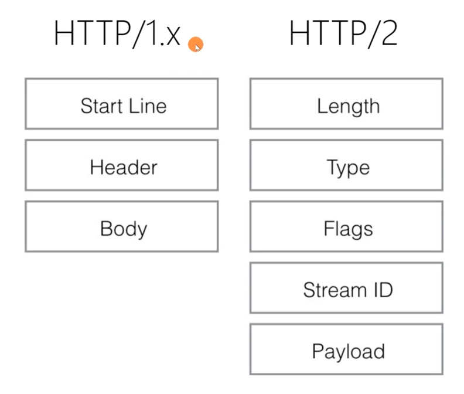


## 帧格式: Stream 流 ID 的作用

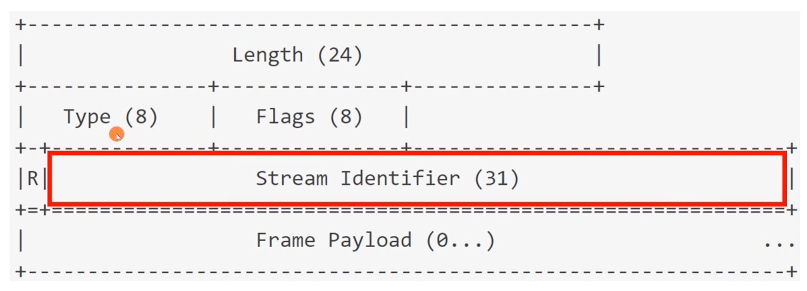

### Stream ID 的作用

- 实现多路复用的关键
  - 接收端的实现可据此并发组装消息
  - 同一 Stream 内的 Frame 必须是有序的 (无法并发)
  - SETTINGS_MAX_CONCURRENT_STREAMS 控制着并发 Stream 数

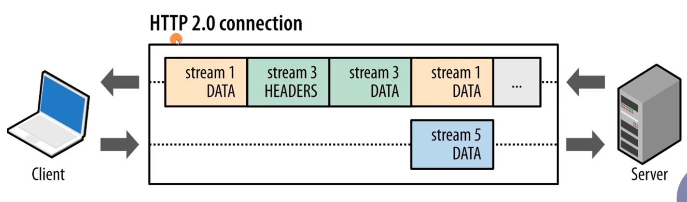

- 推送依赖性请求的关键
  - 由客户端建立的流必须是奇数
  - 由服务器建立的流必须是偶数

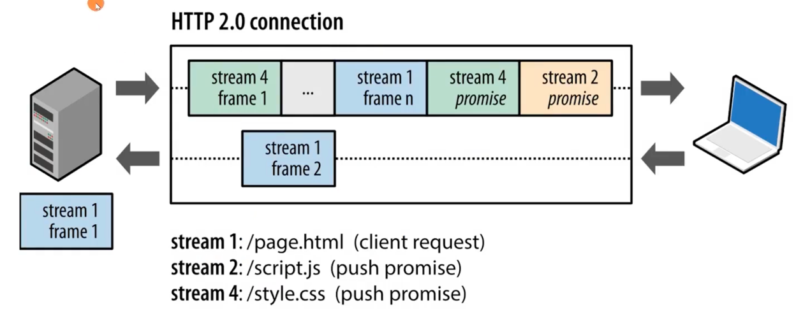

- 流状态管理的约束性规定
  - 新建立的流 ID 必须大于曾经建立过的状态为 opened 或者 reserved 的流 ID
  - 在新建立的流上发送帧时，意味着将更小 ID 且为 idle 状态的流置为 closed 状态
  - Stream ID 不能复用，长连接耗尽 ID 应创建新连接

- 应用层流控仅影响数据帧
  - Stream ID 为 0 的流仅用于传输控制帧


## 帧格式: 帧类型及设置帧的子类型

### 9 字节标准帧头部

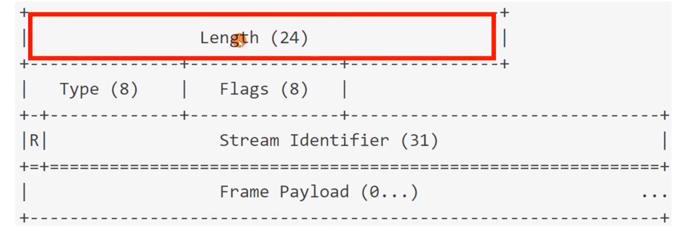

帧长度 Length
- 0 至 2^14(16,384) - 1
  - 所有实现必须可以支持 16KB 以下的帧
- 2^14(16,384) 至 2^24(16,777,215) - 1
  - 传递 16KB 至 16MB 的帧时，必须接收端首先公布自己可以处理此大小
    - 通过 SETTINGS_MAX_FRAME_SIZE 帧 (Identifier=5) 告知

帧类型 Type

| 帧类型           | 类型编码 | 用途                    |
|---------------|------|-----------------------|
| DATA          | 0x0  | 传递 HTTP 包体            |
| HEADERS       | 0x1  | 传递 HTTP 头部            |
| PRIORITY      | 0x2  | 指定 Stream 流的优先级       |
| RST_STREAM    | 0x3  | 终止 Stream 流           |
| SETTINGS      | 0x4  | 修改连接或者 Stream 流的配置    |
| PUSH_PROMISE  | 0x5  | 服务端推送资源时描述请求的帧        |
| PING          | 0x6  | 心跳检测，兼具计算 RTT 往返时间的功能 |
| GOAWAY        | 0x7  | 优雅的终止连接或者通知错误         |
| WINDOW_UPDATE | 0x8  | 实现流量控制                |
| CONTINUATION  | 0x9  | 传递较大 HTTP 头部时的持续帧     |

### Setting 设置帧格式 (type=0x4)

- 设置帧并不是“协商”，而是发送方向接收方通知其特性、能力
- 一个设置帧可同时设置多个对象

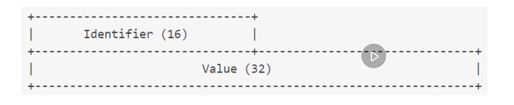

- Identifier: 设置对象
- Value: 设置值

Setting 设置对象的类型(Identifier)

| 类型                              | 类型编码 | 用途                                            |
|---------------------------------|------|-----------------------------------------------|
| SETTINGS_HEADER_TABLE_SIZE      | 0X1  | 通知对端索引表的最大尺寸 (单位字节，初始4096)                    |
| SETTINGS_ENABLE_PUSH            | 0x2  | Value 设置为 0 时可禁用服务器推送功能，1表示启用推送功能             |
| SETTINGS_MAX_CONCURRENT_STREAMS | 0x3  | 告诉接收端允许的最大并发流数量                               |
| SETTINGS_INITIAL_WINDOW_SIZE    | 0x4  | 声明发送端的窗口大小，用于 Stream 级别流控，初始值2^16-1(65,535)字节 |
| SETTINGS_MAX_FRAME_SIZE         | 0x5  | 设置帧的最大大小，初始值2^14(16,384)字节                    |
| SETTINGS_MAX_HEADER_LIST_SIZE   | 0x6  | 知会对端头部索引表的最大尺寸，单位字节，基于未压缩前的头部                 |


## HPACK 如何减少 HTTP 头部的大小？

RFC7541

三种压缩方式
- 静态字典
- 动态字典
- 压缩算法: Huffman 编码 (最高压缩比 8:5)

### 静态字典

[https://httpwg.org/specs/rfc7541.html#static.table.definition](https://httpwg.org/specs/rfc7541.html#static.table.definition)

- 含有 value 的表项
- 不含有 value 的表项

### HPACK 压缩示意

- 同一个索引空间的 HEADER 表

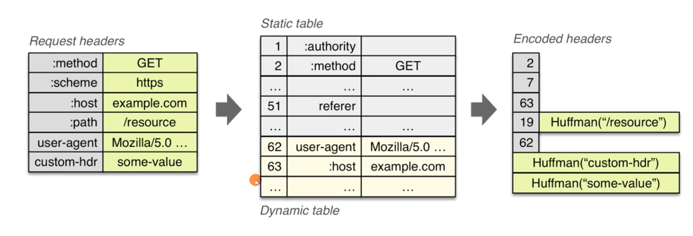


## HPACK 中如何使用 Huffman 树编码？

### Huffman 编码

- 原理：出现概率较大的符号采用较短的编码，概率较小的符号采用较长的编码
- 静态 Huffman 编码
  - https://httpwg.org/specs/rfc7541.html#huffman.code
- 动态 Huffman 编码

### Huffman 树的构造过程

1. 计算各字母的出现概率
2. 将出现频率最小的两个字母相加构成子树，左小右大
3. 重复步骤2，直到完成树的构造
4. 给树的左链接编码为0，右链接编码为1
5. 每个字母的编码即从根节点至所在叶节点中所有链接的编码


## HPACK 中整型数字的编码


## HPACK 中头部名称与值的编码格式


## HTTP/2 的问题及 HTTP/3 的意义

### TCP 以及 TCP+TLS 建立链接握手过多的问题

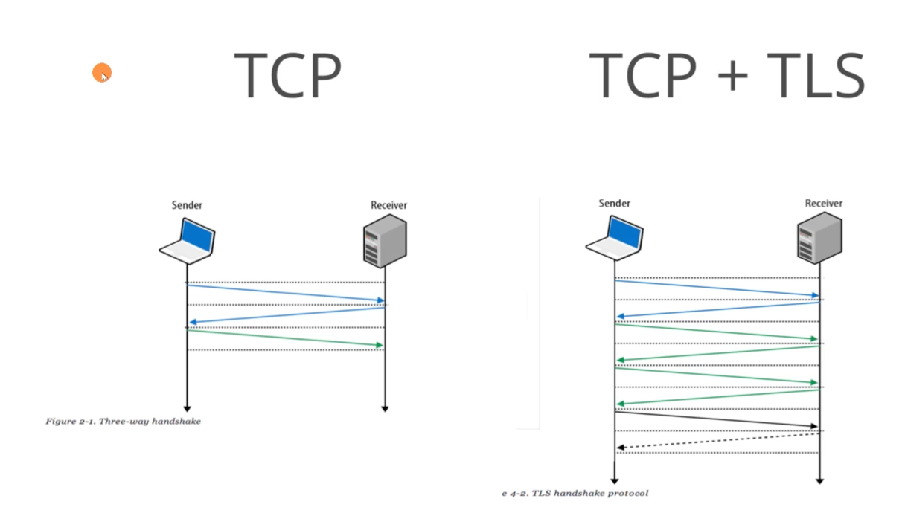

### 多路复用与 TCP 的对头阻塞问题

- 资源的有序到达

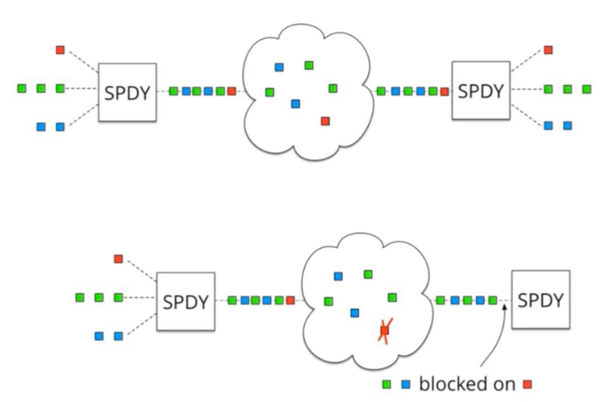

### TCP 的问题

- 由操作系统内核实现，更新缓慢

### QUIC 协议在哪一层？

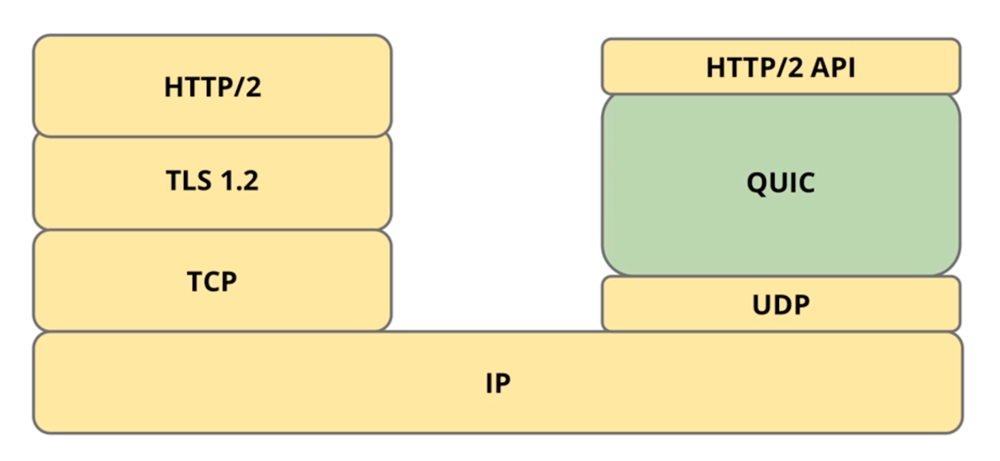

### 使 Chrome 支持 QUIC

chrome://flags/#enable-quic


## HTTP/3: QUIC 协议格式

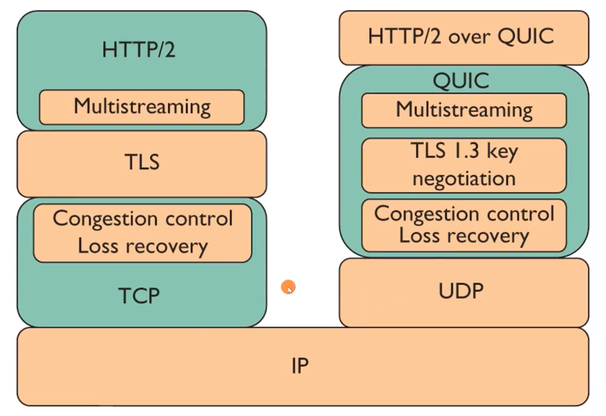

### HTTP3 的连接迁移

允许客户端更换 IP 地址、端口后，仍然可以复用前连接

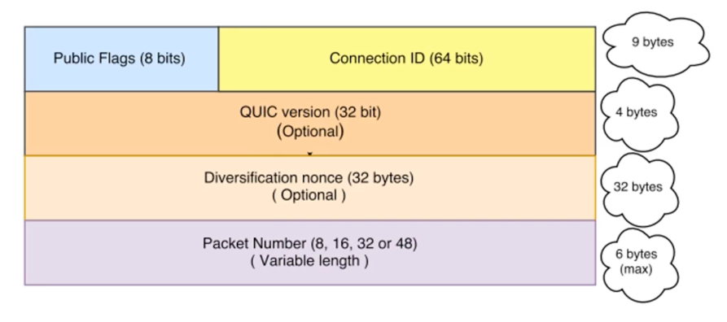

### 解决了对头阻塞问题的 HTTP3

- UDP 报文: 先天没有队列概念

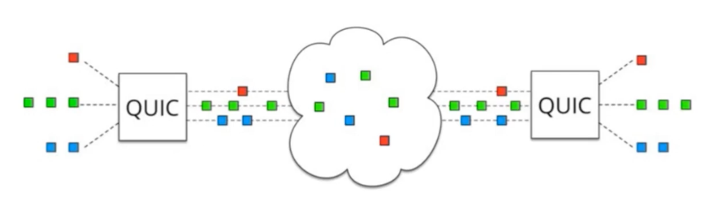

### HTTP3: 1RTT 完全握手

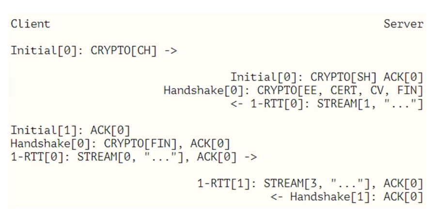

### 会话恢复场景下的 0RTT 握手

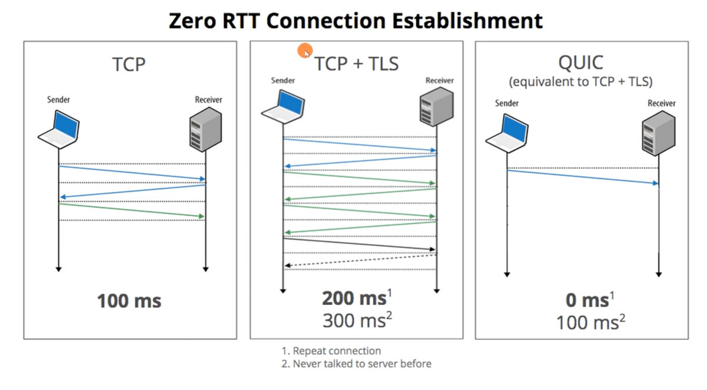

### HTTP3: 0RTT 恢复会话握手

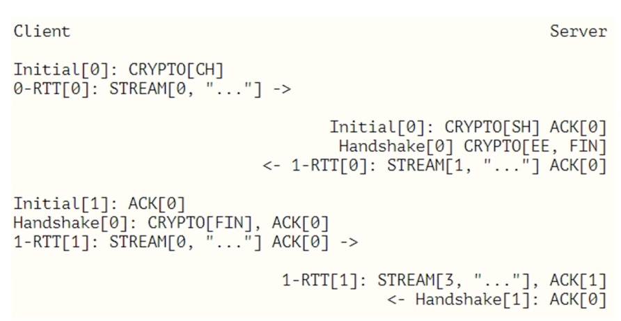
