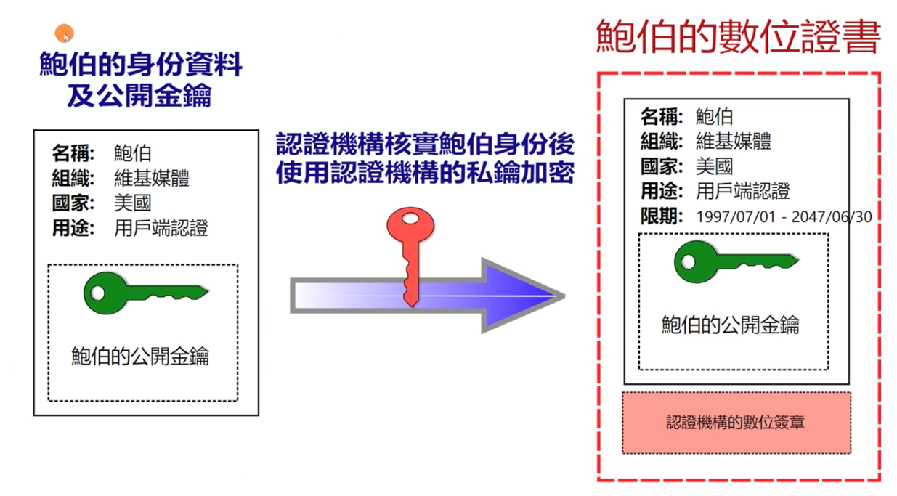

# TLS/SSL 协议

## TLS 协议的工作原理

### TLS 设计目的

- 身份验证
- 保密性
- 完整性

### TLS/SSL 发展


### TLS 协议

- Record 记录协议
  - 对称加密
- Handshake 握手协议
  - 验证通讯双方的身份
  - 交换加解密的安全套件
  - 协商加密参数

### TLS 安全密码套件解读


### TLS 握手

在客户端和服务器开始通过 TLS 交换应用程序数据之前，必须先协商一个加密隧道：客户端和服务器必须就 TLS 协议版本达成一致、选择密码套件、并在必要时验证证书。不幸的是，这些步骤都需要在客户端和服务器之间进行新的数据包往返(RTT)，这会增加所有 TLS 连接的启动延迟。


#### 0ms

TLS 运行在可靠传输协议(TCP)之上，这意味着我们必须首先完成 TCP 的三次握手，这需要一次完整的往返(RTT)。

#### 56ms

TCP 连接就绪后，客户端以纯文本形式发送大量规范，例如正在运行的 TSL 协议版本、支持的密码套件列表以及可能要使用的其他 TLS 选项。

#### 84ms

服务器选择 TLS 协议版本进行进一步通信，从客户端提供的列表中决定密码套件，并附加其证书，并将响应发送回客户端。服务器还可能会发送对客户端证书和其他 TLS 扩展参数的请求。

#### 112ms

假设双方能够协商一个通用版本和密码，并且客户端对服务器提供的证书感到满意，则客户端会启动 RSA 或 Diffie-Hellman 密钥交换，用于为后续会话建立对称加密的密钥。

#### 140ms

服务器处理客户端发送的密钥交换参数，通过验证 MAC 来检查消息完整性，并将加密完成的消息返回给客户端。

#### 168ms

客户端使用协商的对称密钥解密消息，验证MAC，如果一切正常，则建立隧道，现在可以发送应用程序数据了。

正如上面的交换示意图，新的 TLS 连接需要两次往返(2RTT)才能进行**完全握手**。

## 对称加密的工作原理: XOR 与填充

### 对称加密


### AES 对称加密在网络中的应用


### 对称加密与 XOR 异或运算


### 填充 padding

- Block cipher 分组加密: 将明文分成多个等长的 Block 模块，对每个模块分别加解密
- 目的: 当最后一个明文 Block 模块长度不足时，需要填充
- 填充方法
  - 位填充: 以 bit 位为单位进行填充
    - [ 1011 1001 1101 0100 0010 011(1 0000 0000) ]
  - 字节填充: 以字节为单位进行填充
    - 补零: [ DD DD DD DD DD DD DD DD | DD DD DD DD (00 00 00 00) ]
    - ANSI X9.23: [ DD DD DD DD DD DD DD DD | DD DD DD DD (00 00 00 04) ]
    - ISO 10126: [ DD DD DD DD DD DD DD DD | DD DD DD DD (81 A6 23 04) ]
    - PKCS7(RFC5652): [ DD DD DD DD DD DD DD DD | DD DD DD DD (04 04 04 04) ]

## 对称加密的工作原理: 工作模式

### 分组工作模式 block cipher mode of operation

允许使用同一个分组密码密钥对多块数据进行加密，并保证其安全性

#### 1. ECB (Electronic codebook) 模式

直接将明文分解为多个块，对每个块独立加密


问题: 无法隐藏数据特征


#### 2. CBC (Cipher-block chaining) 模式

每个明文块先与前一个密文块进行异或后，再进行加密


问题: 加密过程串行化

#### 3. CTR (Counter) 模式

通过递增一个加密计数器以产生连续的密钥流


问题: 不能提供密文消息完整性校验

### 验证完整性: hash 函数


### 验证完整性: MAC (Message Authentication Code)


#### 4. GCM 模式

Galois/Counter Mode (CTR + GMAC)


## 详解 AES 对称加密算法

AES - Advanced Encryption Standard

https://nvlpubs.nist.gov/nistpubs/fips/nist.fips.197.pdf

- 由比利时密码学家 Joan Daemen 和 Vincent Rijmen 所设计，又称 Rijndael 加密算法
- 常用填充算法: PKCS7
- 常用分组工作模式: GCM

### AES 的三种密钥长度

AES 的分组长度是 128 位 (16字节)

| AES     |  密钥长度 (单位: 32bit)  |  分组长度 (单位: 32bit)  |  加密轮数  |
|---------|:------------------:|:------------------:|:------:|
| AES-128 |         4          |         4          |   10   |
| AES-192 |         6          |         4          |   12   |
| AES-256 |         8          |         4          |   14   |

### AES 的加密步骤

1. 把明文按照 128bit (16字节) 拆分成若干个明文块，每个明文块是 4*4 矩阵
2. 按照选择的填充方式填充最后一个明文块
3. 每个明文块利用 AES 加密器和密钥，加密成密文块
4. 拼接所有的密文块，称为最终的密文结果

### AES 加密流程


C = E(K, P)

E 为每一轮算法，每轮密钥皆不同

- 初始轮
  - AddRoundKey 轮密钥加
- 普通轮
  - AddRoundKey 轮密钥加
  - SubBytes 字节替代
  - ShiftRows 行移位
  - MixColumns 列混合
- 最终轮
  - SubBytes 字节替代
  - ShiftRows 行移位
  - AddRoundKey 轮密钥加

#### 1. AddRoundKey 步骤

矩阵中的每一个字节都与该次回合密钥 (round key) 做 XOR 运算；每个子密钥由密钥生成方案产生。


#### 密钥扩展


函数 g 步骤:
- a: 字循环: 左移 1 个字节
- b: 使用 S 盒字节代换
- c: 同轮常量 RC[j] 进行异或，其中 j 表示轮数

RC={0x01, 0x02, 0x04, 0x08, 0x10, 0x20, 0x40, 0x80, 0x1B, 0x36}

#### 2. SubBytes 步骤

透过一个非线性的替换函数，用查找表的方式把每个字节替换成对应的字节。
提供非线性变换能力，避免简单代数性质的攻击


#### 3. ShiftRows 步骤

将矩阵中的每个横列进行循环式移位。

第一行不变，第二行循环左移 1 个字节，第三行循环左移 2 个字节，第四行循环左移 3 个字节


#### 4. MixColumns 步骤


## 非对称密码与 RSA 算法

### 非对称密码

每个参与方都有一对密钥，公钥向对方公开，私钥仅自己使用


### 非对称加解密的过程

加密：使用对方的公钥加密消息
解密：使用自己的私钥解密消息


### RSA 算法

1977 年由罗纳德-李维斯特 (Ron Rivest)、阿迪-萨莫尔 (Adi Shamir) 和伦纳德-阿德曼 (Leonard Adleman) 一起提出，因此名为 RSA 算法。

#### RSA 算法中公私钥的产生

1. 随机选择两个不相等的质数 p 和 q
2. 计算 p 和 q 的乘积 n (明文小于 n)
3. 计算 n 的欧拉函数 v = s(n)
4. 随机选择一个整数 k，1<k<v,且k与v互质
5. 计算 k 对于 v 的模反元素 d
6. 公钥: (k, n)
7. 私钥: (d, n)


#### RSA 算法加解密流程


## 基于 OpenSSL 实战验证 RSA

使用 openssl 基于 RSA 算法生成公私钥

### 生成私钥 (公私钥格式参见 RFC3447)

```shell
openssl genrsa -out private.pem
```


### 从私钥中提取出公钥

```shell
openssl rsa -in private.pem -pubout -out public.pem
```


### 查看 ASN.1 格式的私钥

```
RSAPrivateKey ::= SEQUENCE {
    version Version,
    modulus Integer, -- n
    publicExponent Integer, -- k
    privateExponent Integer, -- d
    prime1 Integer, -- p
    prime2 Integer, -- q
    exponent1 Integer, -- d mod (p-1)
    exponent2 Integer, -- d mod (q-1)
    coefficient Integer, -- (inverse of q)
    otherPrimeInfos OtherPrimeInfos Optional
}
```

```shell
openssl asn1parse -i -in private.pem
```


### 查看 ASN.1 格式的公钥

```shell
openssl asn1parse -i -in public.pem
```


```shell
openssl asn1parse -i -in public.pem -strparse 19
```


### 使用 RSA 公私钥加解密

加密文件
```shell
openssl rsautl -encrypt -in hello.txt -inkey public.pem -pubin -out hello.en
```

解密文件
```shell
openssl rsautl -decrypt -in hello.en -inkey private.pem -out hello.de
```

## 非对称密码应用: PKI 证书体系

### 非对称密码应用: 数字签名

- 基于私钥加密，只能使用公钥解密: 起到身份认证的使用
- 公钥的管理: Public Key Infrastructure (PKI) 公钥基础设施
    - 由 Certificate Authority (CA) 数字证书认证机构将用户个人身份与公开密钥关联在一起
    - 公钥数字证书组成
        - CA 信息、公钥用户信息、公钥、权威机构的签字、有效期
    - PKI 用户
        - 向 CA 注册公钥的用户
        - 希望使用已注册公钥的用户

### 签发证书流程



### 签名与验签流程


### 证书信任链


### PKI 公钥基础设施


### 证书类型


### 验证证书链


## 非对称密码应用: DH 密钥交换协议

### RSA 密钥交换

由客户端生成对称加密的密钥


问题: 没有前向保密性

> 前向保密性:
> 假设有个中间人在没有破解服务器私钥时，已经通过网络中间设备把所有的通信报文保存下来，等某一天破解出服务器的私钥，那么就可以基于私钥解出对称加密的密钥，然后就可以把全部的报文解密。

### DH 密钥交换

1976 年由 Bailey Whitfield Diffie 和 Martin Edward Hellman 首次发表，故称为 Diffie-Hellman key exchange，简称 DH。

它可以让双方在完全没有对方任何预先信息的条件下，通过不安全信道创建起一个密钥，具备前向保密性。


### DH 密钥交换协议举例

- g, p, A, B 公开
- a, b 保密
- 生成共同密钥 K


### DH 密钥交换协议举例


### DH 密钥交换协议的问题

- 中间人伪造攻击
  - 向 Alice 假装自己是 Bob，进行一次 DH 密钥交换
  - 向 Bob 假装自己是 Alice，进行一次 DH 密钥交换
- 解决中间人伪造攻击
  - 身份验证

## ECC 椭圆曲线的特性

### ECC 椭圆曲线的定义

椭圆曲线的表达式:
```
y^2 = x^3 + ax + b (4a^3 + 27b^2 != 0)
```

例如，始终关于 X 轴对称 (y平方的存在)


### ECC 曲线的特性: +运算

P + Q = R

- +运算的几何意义: R 为 P、Q 连线与曲线交点在 X 轴上的镜像
- P + P = R

+运算满足交换律: a + b = b + a

+运算满足结合律: (a + b) + c = a + (b + c)


### +运算的代数计算方法

先计算出斜率 m，再计算出 R 点的坐标


### ECC +运算举例


### ECC 的关键原理

Q = K.P

- 已知 K 与 P，正向计算快速
- 已知 Q 与 P，计算 K 的逆向运算非常困难


## DH 协议升级: 基于椭圆曲线的 ECDH 协议

DH 密钥交换协议使用椭圆曲线后的变种，称为 Elliptic Curve Diffie-Hellman key exchange, 缩写为 ECDH，优点是比 DH 计算速度快、同等安全条件下密钥更短

ECC (Elliptic Curve Cryptography): 椭圆曲线密码学

魏尔斯特拉斯椭圆函数: y^2 = x^3 + ax + b


### ECDH 的步骤

1. Alice 选定大整数 Ka 作为私钥
2. 基于选定曲线及曲线上的共享 P 点，Alice 计算出 Qa = Ka.P
3. Alice 将 Qa、选定曲线、共享 P 点传递给 Bob
4. Bob 选定大整数 Kb 作为私钥，将计算了 Qb = Kb.P，并将 Qb 传递给 Alice
5. Alice 生成密钥 Qb.Ka = (X, Y)，其中 X 为对称加密的密钥
6. Bob 生成密钥 Qa.Kb = (X, Y)，其中 X 为对称加密的密钥

```
Qb.Ka = Ka.(Kb.P) = Ka.Kb.P = Kb.(Ka.P) = Qa.Kb
```

### X25519 曲线

椭圆曲线变种: Montgomery curve 蒙哥马利曲线

By^2 = x^3 + Ax^2 + x

如图，A=7, B=3


X25519: y^2 = x^3 + 486662x^2 + x

- p 等于 2^255 - 19，基点 G=9
- order N

## TLS1.2 与 TLS1.3 中的 ECDH 协议

### TLS1.2 通讯过程


### FREAK 攻击

- 2015 年发现漏洞
- 90 年代引入
  - 512 位以下 RSA 密钥可轻易破解


### openssl 1.1.1 版本对 TLS1.3 的支持情况

> TLS1.3 大大减少了所支持的安全套件的数量，尤其是把一些不够安全的、很古老的安全套件算法取消了。

Cipher suites 安全套件:
- TLS13-AES-256-GCM-SHA384
- TLS13-CHACHA20-POLY1305-SHA256
- TLS13-AES-128-GCM-SHA256
- TLS13-AES-128-CCM-8-SHA256
- TLS13-AES-128-CCM-SHA256

### 测试 TLS 站点支持情况

https://www.ssllabs.com/ssltest/index.html

### TLS1.3 中的密钥交换


## 握手的优化: session 缓存、ticket 票据及 TLS1.3 的 0-RTT

### session 缓存: 以服务器生成的 session ID 为依据

Session resume with session ID


### session ticket

Session resume with session ticket


### TLS1.3 的 0-RTT 握手


### 0-RTT 面临的重放攻击


## TLS 与量子通讯的原理

### TLS 密码学回顾

- 通讯双方在身份验证的基础上，协商出一次性的、随机的密钥
  - PKI 公钥基础设施
  - TLS 中间件生成一次性的、随机的密钥参数
  - DH 系列协议基于非对称加密技术协商出密钥
- 使用分组对称加密算法，基于有限长度的密钥将任意长度的明文加密传输
  - 密钥位数
  - 分组工作模式

### 克劳德-艾尔伍德-香农: 信息论

证明 one-time-password (OTP) 的绝对安全性
- 密钥是随机生成的
- 密钥的长度大于等于明文长度
- 相同的密钥只能使用一次

如何传递密钥？

### QKD 与光偏振原理

量子密钥分发 quantum key distribution，简称 QKD

- 量子力学: 任何对量子系统的测量都会对系统产生干扰
- QKD: 如果有第三方试图窃听密码，则通信的双方便会察觉


## 量子通讯 BB84 协议的执行流程

### BB84 协议

由 Charles Bennett 与 Gilles Brassard 在 1984 年发表


### BB84 协议示意图

50% * 50% = 25% 的错误率


### QKD 密钥纠错与隐私增强


