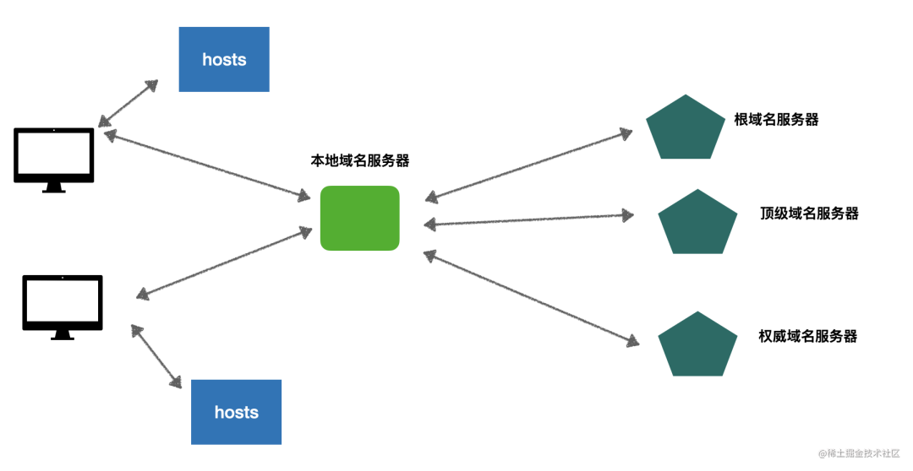

# DNS 相关知识

## 用 Node.js 手写一个 DNS 服务器

https://mp.weixin.qq.com/s/Gl94ISY5N4BYyYmVT9-QFQ

域名解析的时候会先查询 hosts 文件，如果没查到就会请求本地 DNS 服务器，这个是 ISP 提供的，一般每个城市都有一个。

本地 DNS 服务器负责去解析域名对应的 IP，它会依次请求根域名服务器、顶级域名服务器、权威域名服务器，来拿到最终的 IP 返回给客户端。

## 一文搞懂 DNS 基础知识，收藏起来有备无患

https://mp.weixin.qq.com/s/Qv7tDIbUruzw9vLtuWyo1Q

### DNS 有以下特点

- 分布式的
- 协议支持 TCP 和 UDP，常用端口是 53
- 每一级域名的长度限制是 63
- 域名总长度限制是 253

> 每一级长度限制是因为在 DNS 报文格式中，域名按照 . 分成多个段，每一段的长度存放在一个字节中，并且这个字节要求前两个比特为00，因此只能用6个比特位来表示，也就是 2^6-1 = 63

*那么，什么情况下使用 TCP，什么情况下使用 UDP 呢？*

最早的时候，DNS 的 UDP 报文上限大小是 512 字节，所以当某个 response 大小超过 512 (返回信息太多)，DNS 服务就会使用 TCP 协议来传输。后来 DNS 协议扩展了自己的 UDP 协议，DNS client 发出查询请求时，可以指定自己能接收超过 512 字节的 UDP 包，这种情况下，DNS 还是会使用 UDP 协议。

### 中文域名的 DNS 解析

需要先转换为 `punycode` 编码: https://www.punycoder.com
