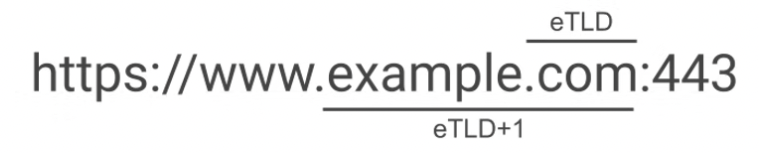
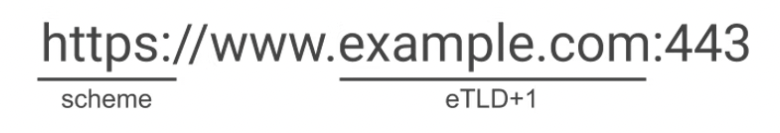
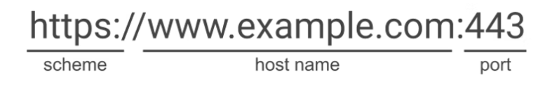
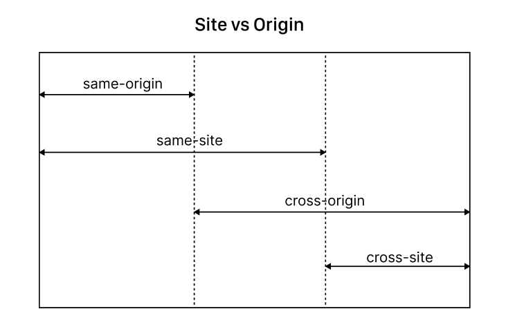
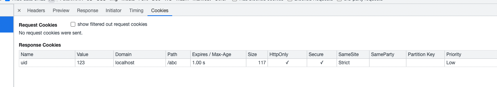

# Cookie

在完全掌握 Cookie 策略之前，有必要先理解 Site 与 Origin 的概念。

## Site 的定义

> https://developer.mozilla.org/en-US/docs/Glossary/Site



可以看到，两个 URL 只要 eTLD+1 相同，就视为同一个 Site。这种 Same-Site 的定义没有考虑 Scheme，因此也被称为 scheme-less same-site。后来考虑到 Scheme 之后，对 Site 的定义进行了更新，如下：



这种 Same-Site 也被称为 schemeful same-site。

由此可知，Site = (scheme, eTLD+1) 二元组。

> 由于 Cookie 并没有记录 Scheme 信息，所以 http 和 https 是共享 Cookie 的，也就是说，http://www.example.com 设置的 Cookie 可以被 https://www.example.com 的请求携带，同理，https://www.example.com 设置的 Cookie 也可以被 http://www.example.com 的请求携带。
> 重点在于发起请求时是否满足 Same-Site 要求。

## Origin 的定义

> https://developer.mozilla.org/en-US/docs/Glossary/Origin



Origin = (scheme, domain, port) 三元组。

## Site vs Origin

根据上面的定义，我们可以把所有 URL 之间的关系划分为以下 4 种：

- same-site
- cross-site
- same-origin
- cross-origin

它们之间的关系如下：



也就是说，同源(same-origin)必定同站(same-site)，跨站(cross-site)必定跨域(cross-origin)。
但是我们还可以发现，跨域(cross-origin)和同站(same-site)之间是有交集的，也就是说，有些跨域请求也属于同站请求。这一点是很重要的，后面在讲 Cookie 策略的时候会用到。

> 除了根据 url 自己判断请求是否是同站请求之外，还可以直接查看请求头中的 `Sec-Fetch-Site` 字段，它的值有 `cross-site`、`same-site`、`same-origin`、`none`。
> `none`表示用户通过地址栏直接输入 URL，或者通过浏览器的书签、历史记录等方式打开的页面。另外3种则表示浏览器能够正常发送的所有请求类型，而 cross-origin 则只会出现在 fetch 或者 XMLHttpRequest 中，通过 CORS 策略来控制。


## Cookie 属性


上面这张图是 Chrome 浏览器的一个响应中设置 Cookie 的相关信息。

可以看到有如下这些属性：
- Name
- Value
- Domain
- Path
- Expires/Max-Age
- Size
- HttpOnly
- Secure
- SameSite
- SameParty
- Partition Key
- Priority

下面就详细解读下这些属性的作用。

### Name / Value

`Name`和`Value`就不用多说了。

但是`Name`要稍微特殊一些，因为它可以使用特定的前缀，以表示某种断言。如果断言失败，则浏览器将忽略这个 Cookie。
一般用于`Set-Cookie`头部，用来确保这个 Cookie 满足某些安全要求。

目前有 2 个前缀可供使用：
- `__Secure-`: 表示这个 Cookie 需要有`Secure`这个标志。
- `__Host-`: 表示这个 Cookie 需要有`Secure`这个标志，同时不能设置`Domain`属性(也就是说，这个 Cookie 只能被严格用于当前域名，不能用于子域名)，`Path`属性也必须是`/`。

对于支持前缀的浏览器，在接收到`Set-Cookie`时，会先检查这条 Cookie 的属性是否满足前缀的要求，如果不满足，则忽略这个 Cookie。

### Domain / Path

`Domain`和`Path`共同指定了这个 Cookie 可以在哪些 url 请求中发送，也就是说，当某个请求匹配这个 Cookie 的 `Domain`和`Path`属性时，这个 Cookie 就可以放在这个请求里面，随请求一块发给服务器。

如果没有指定`Domain`，则默认为当前页面的域名，不包含子域名。在浏览器中看到的就是当前页面的域名。如果手动指定了当前页面的域名，则看到的就是以`.`开头的域名，表示包含当前域名以及所有子域名。

给 Cookie 设置的`Domain`属性必须包含在当前文档的域名中，也就是说，`Domain`属性必须是当前文档的域名或者当前文档的父域名。

> 显式指定域名反而可以 **放宽** 这个 Cookie 的使用范围

### Expires / Max-Age

`Expires`和`Max-Age`这两个属性都是用于设置这个 Cookie 的生存期的。`Expires`用于设置绝对过期时间，`Max-Age`用于设置相对过期时间(秒数)，这两个时间都是客户端时间。
如果这两个属性都没设置，则该 Cookie 为会话 Cookie。
`Expires`设置成过去的时间，或者`Max-Age`设置成0或负数时，都会使 Cookie 立即失效。


### Size

`Size`属性表示这个 Cookie 的大小，这个大小是`Set-Cookie`值的长度，也就是浏览器需要存储这个 Cookie 需要占用的空间。


### HttpOnly

`HttpOnly`是一个标志位，如果有这个标志则表示这条 Cookie 不能被客户端脚本读取(包括任何客户端api)，只能由浏览器在发请求时携带。

> 可以避免 XSS 攻击，因为客户端不能读取到这个 Cookie。


### Secure

`Secure`也是一个标志位，如果有这个标志则表示这条 Cookie 只能随 https 的请求一块发送。


### SameSite

> 注意，这里用的是 Site 的定义

`SameSite`定义这个 Cookie 在涉及跨站请求时是否发送，也就是定义三方 Cookie 是否可以被共享。

这个属性有 3 个取值：
- Strict
- Lax(默认值)
- None

`Strict`表示浏览器只会在同站请求中发送这个 Cookie，也就是说，只有来自于设置这个 Cookie 的那个站点的请求才能携带这个 Cookie。
如果请求来自于另一个站点，则请求不能携带这个 Cookie。

这个配置属于最严格的，比如你从百度搜索的链接点进一个网站，由于进入首页的这个请求是从百度的页面发出的，所以不属于同站请求，也就不会携带这个网站的`Strict`类型的 Cookie。
而后续的请求都是由于首页的链接发起的，属于同站请求，所以可以正常携带`Strict`类型的 Cookie。

`Lax`也表示对于跨站请求不会发送`Cookie`。比如，你在百度的页面加载了一张你自己的图片，因为这个图片的请求来自于百度，所以属于跨站请求，请求中并不会包含你设置的`Lax`类型的 Cookie。
但比`Strict`更宽松的是，如果你是跟随一个链接导航到你的页面的话，则初始请求是可以携带`Lax`类型的 Cookie 的。
除了**导航**这种特殊的跨站请求，别的跨站请求都不可携带这种类型的 Cookie。

> `Strict`和`Lax`这两个配置可以有效防止 CSRF 类型的网络攻击，因为对于跨站的请求浏览器将不再携带这两种类型的 Cookie 了。

`None`表示无论是跨站请求，还是同站请求都可以发送这种类型的 Cookie。
但这个值需要和`Secure`标志同时使用。

#### SameSite 和 Domain 对于 cookie 的发送限制有什么区别？
`Domain`只考虑请求的域名与 Cookie 的域名是否匹配，而不管这个请求来自于哪里？是怎么发起的？只要请求的域名符合这个 Cookie 的域名规则，就可以携带这个 Cookie。
而`SameSite`考虑的是这个请求来自于哪里？是否是站内发起的请求？如果是站外发起的请求(跨站请求)，则哪些请求可以携带，哪些请求不可以携带？


### SameParty
`SameParty`是 Chrome89+ 增加的，目前不属于标准，各浏览器实现不一。
参考 [Feature: 'SameParty' cookie attribute](https://chromestatus.com/feature/5280634094223360)


### Partition Key

与隐私有关，参考: 

- [State Partitioning](https://developer.mozilla.org/en-US/docs/Web/Privacy/State_Partitioning)
- [CHIPs](https://www.theregister.com/2021/07/02/google_cookie_chips/)
- [CHIPs](https://developer.chrome.com/docs/privacy-sandbox/chips/)


### Priority

> https://bugs.chromium.org/p/chromium/issues/detail?id=232693

优先级，这个属性也是 Chrome 独有的，与 Cookie 的删除策略有关。
取值如下：
- Low
- Medium (默认值)
- High

我们知道，每个域名的 Cookie 数量是有上限的，超过这个限制之后，浏览器通常会删除一些老的 Cookie 来释放空间。

但是每个浏览器的删除策略是不一样的，IE 和 Opera 会根据 LRU 策略删除最老未使用的 Cookie，FireFox 则随机删除，Chrome 增加这个属性来让服务器有能力给 Cookie 设置优先级，当 Cookie 数量超过限制时，Chrome 会优先删除低优先级的 Cookie，这样来确保高优先级 Cookie 的寿命更长。

## 请求的 Credentials 策略

以上介绍的都是普通请求(由浏览器自动发起的)携带 Cookie 的策略，还有一类与 Cookie 有关的策略，叫做请求的 Credentials 策略。这些请求都是通过 JavaScript API 发起的，比如 XMLHttpRequest，Fetch 等。

### Fetch 的 credentials 属性

Fetch 请求有一个参数叫做 `credentials`，它的取值如下：
- omit
- same-origin (默认)
- include

这个参数用于控制 Cross-Origin 请求是否携带 Cookie。
`omit`表示不携带 Cookie，也不接受服务器设置的 Cookie。
`same-origin`表示对于同源的请求携带 Cookie，也接受同源请求的响应设置 Cookie。
`include`表示 same-origin 和 cross-origin 的请求都需要携带 Cookie。但这里的 cross-origin 仅包含 same-site 范围内的跨域请求。也就是我们之前说的 same-site 和 cross-origin 交叉的部分。

也就是说，对于 same-site 和 cross-origin 交叉的这部分请求，浏览器发起的请求和 fetch 发起的默认请求是不一样的。因为这部分请求属于 same-site，满足 Cookie 的 Same-site 属性要求，因此浏览器发起的请求会自动携带相关 Cookie，比如你加载了一张子域名下的图片，这个图片请求会自动携带子域名设置的 Cookie 的。但如果你是通过 fetch 发起的这个请求，则默认情况下是不会携带 Cookie 的，因为 fetch 的 credentials 默认值是 same-origin，子域和顶域不属于同一个 origin，所以不会携带 Cookie。

也就是说，对于交叉的这部分请求，下面的 fetch 调用才和浏览器发起的请求行为一致(即满足 Cookie 的 Same-site 属性要求即可)：
```js
fetch(url, {credentials: 'include', mode: 'no-cors'})
```

### XMLHttpRequest 的 withCredentials 属性

这个属性是一个布尔值，表示跨站请求(cross-site)是否需要携带 Cookie，对同站请求(same-site)无效。
默认值为`false`。

> 注意：这里的**跨站**(cross-site)其实应该指的是**跨域**(cross-origin)

不管是 fetch 还是 XMLHttpRequest，对于 cors 请求想要携带 Cookie 的话，则响应必须设置 `Access-Control-Allow-Credentials` 头，并且 `Access-Control-Allow-Origin`头不能为`*`, 否则都是无法携带 Cookie 的。不过 fetch 还可以通过设置`mode=no-cors`来绕过 cors 的限制，模拟浏览器发送非 cors 请求，这样就不需要设置这些头了。

## 相关资源

- [MDN: Using HTTP cookies](https://developer.mozilla.org/en-US/docs/Web/HTTP/Cookies)
- [MDN: Set-Cookie header](https://developer.mozilla.org/en-US/docs/Web/HTTP/Headers/Set-Cookie)
- [MDN: Cookie header](https://developer.mozilla.org/en-US/docs/Web/HTTP/Headers/Cookie)
- [Cookie 规范: RFC6265](https://datatracker.ietf.org/doc/html/rfc6265)
- [Cookie 新的草案: RFC6265bis-10](https://www.ietf.org/archive/id/draft-ietf-httpbis-rfc6265bis-10.txt)
- [web.dev: Cookies articles](https://web.dev/tags/cookies/)
- [web.dev: First-party Cookie](https://web.dev/first-party-cookie-recipes/)
- [web.dev: Same-site and Same-origin](https://web.dev/same-site-same-origin/)
